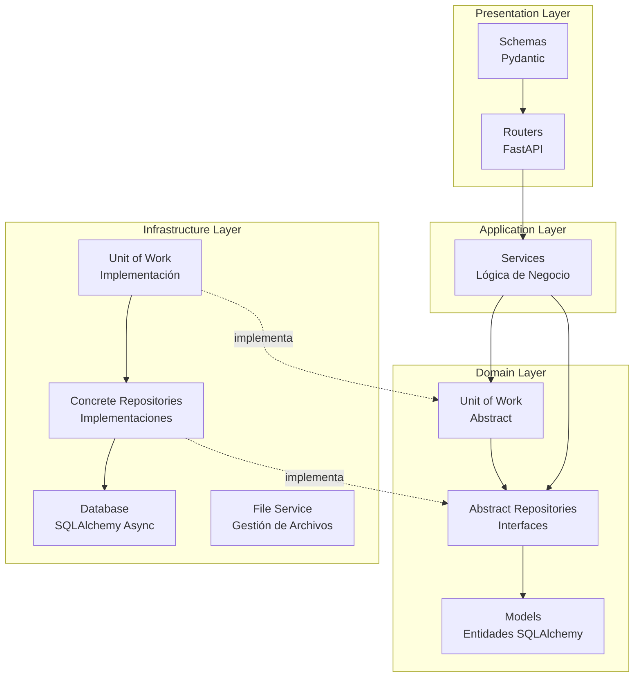
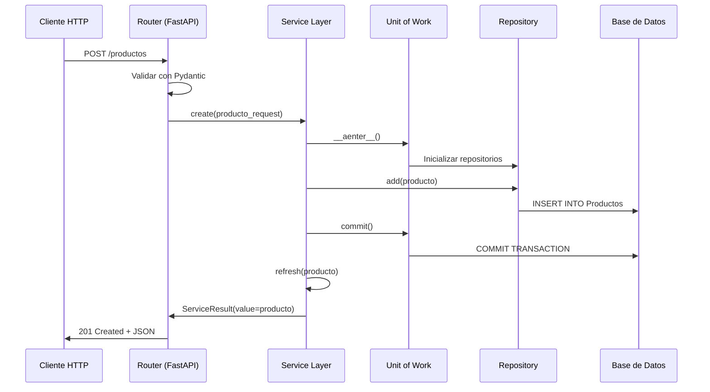

# Arquitectura del Proyecto PizzaFiori

## Descripción General

PizzaFiori está construido siguiendo los principios de **Clean Architecture**, una arquitectura en capas que separa las responsabilidades del código y facilita el mantenimiento, las pruebas y la escalabilidad del proyecto.

## Arquitectura por Capas

El proyecto está organizado en cuatro capas principales:

```
┌─────────────────────────────────────────────────────────┐
│              Presentation Layer (API)                  │
│  ┌──────────────────────────────────────────────────┐  │
│  │  Routers (FastAPI)  │  Schemas (Pydantic)        │  │
│  └──────────────────────────────────────────────────┘  │
└─────────────────────────────────────────────────────────┘
                        ↓
┌─────────────────────────────────────────────────────────┐
│            Application Layer (Casos de Uso)             │
│  ┌──────────────────────────────────────────────────┐  │
│  │  Services (Lógica de Negocio)                   │  │
│  └──────────────────────────────────────────────────┘  │
└─────────────────────────────────────────────────────────┘
                        ↓
┌─────────────────────────────────────────────────────────┐
│              Domain Layer (Reglas de Negocio)          │
│  ┌──────────────────────────────────────────────────┐  │
│  │  Models (Entidades)  │  Repositories (Abstract) │  │
│  └──────────────────────────────────────────────────┘  │
└─────────────────────────────────────────────────────────┘
                        ↓
┌─────────────────────────────────────────────────────────┐
│        Infrastructure Layer (Implementaciones)          │
│  ┌──────────────────────────────────────────────────┐  │
│  │  Database  │  Repositories  │  File Service     │  │
│  └──────────────────────────────────────────────────┘  │
└─────────────────────────────────────────────────────────┘
```

### Diagrama de Capas



## Descripción de Capas

### 1. Presentation Layer (Capa de Presentación)

**Ubicación:** `backend/app/presentation/`

**Responsabilidades:**
- Manejar las peticiones HTTP entrantes
- Validar datos de entrada usando Pydantic
- Serializar respuestas
- Manejar errores HTTP

**Componentes:**
- **Routers** (`routers/`): Endpoints FastAPI que exponen la API REST
- **Schemas** (`schemas/`): Modelos Pydantic para validación y serialización

**Ejemplo de flujo:**
```python
# Router recibe request HTTP
@router.post("/productos/")
async def create_producto(...):
    # Valida datos con Pydantic
    producto_request = ProductoCreateRequest(...)
    # Delega al servicio
    result = await service.create(producto_request)
    # Retorna respuesta HTTP
    return result.value
```

### 2. Application Layer (Capa de Aplicación)

**Ubicación:** `backend/app/application/`

**Responsabilidades:**
- Contener la lógica de negocio
- Coordinar operaciones entre repositorios
- Validar reglas de negocio
- Manejar transacciones a través del Unit of Work

**Componentes:**
- **Services** (`*_service.py`): Servicios que implementan casos de uso específicos

**Características:**
- No depende directamente de la infraestructura
- Usa abstracciones (repositorios abstractos)
- Retorna `ServiceResult` para manejo consistente de errores

**Ejemplo:**
```python
class ProductService:
    async def create(self, producto_create: ProductoCreateRequest) -> ServiceResult:
        # Lógica de negocio
        # Validaciones
        # Coordinación con repositorios
        async with self.uow as uow:
            producto = Product(...)
            await uow.product_repo.add(producto)
            await uow.commit()
        return ServiceResult(value=producto)
```

### 3. Domain Layer (Capa de Dominio)

**Ubicación:** `backend/app/domain/`

**Responsabilidades:**
- Definir entidades del dominio
- Definir interfaces abstractas de repositorios
- Contener reglas de negocio puras
- No tener dependencias externas

**Componentes:**
- **Models** (`models/`): Entidades SQLAlchemy que representan el dominio
- **Repositories** (`repositories/`): Interfaces abstractas de repositorios
- **Unit of Work** (`unit_of_work.py`): Interfaz abstracta para gestión transaccional

**Características:**
- Independiente de frameworks
- Define contratos (interfaces) que deben cumplir las implementaciones
- Contiene las entidades de negocio

**Ejemplo:**
```python
# Modelo de dominio
class Product(Base):
    __tablename__ = "Productos"
    id = Column(Integer, primary_key=True)
    nombre = Column(String(255), nullable=False)
    # ...

# Repositorio abstracto
class AbstractProductRepository(ABC):
    @abstractmethod
    async def add(self, product: Product) -> Product:
        ...
```

### 4. Infrastructure Layer (Capa de Infraestructura)

**Ubicación:** `backend/app/infrastructure/`

**Responsabilidades:**
- Implementar las abstracciones definidas en Domain
- Gestionar acceso a base de datos
- Manejar servicios externos (archivos, logging, etc.)
- Configuración del sistema

**Componentes:**
- **Database** (`database.py`): Configuración de SQLAlchemy y conexión a BD
- **Repositories** (`repositories/`): Implementaciones concretas de repositorios
- **Unit of Work** (`unit_of_work.py`): Implementación concreta del UoW
- **File Service** (`file_service.py`): Gestión de archivos subidos
- **Config** (`config/`): Configuración de la aplicación
- **Logging** (`logging.py`): Configuración de logging estructurado

**Ejemplo:**
```python
class SqlAlchemyProductRepository(BaseRepository[Product], AbstractProductRepository):
    async def add(self, product: Product) -> Product:
        self.session.add(product)
        return product
```

## Patrones de Diseño Implementados

### 1. Repository Pattern

**Propósito:** Abstraer el acceso a datos y facilitar el cambio de implementación.

**Implementación:**
- **Abstract Repository** (Domain): Define el contrato
- **Concrete Repository** (Infrastructure): Implementa con SQLAlchemy

**Beneficios:**
- Desacopla la lógica de negocio del acceso a datos
- Facilita las pruebas unitarias (mocks)
- Permite cambiar la implementación sin afectar el dominio

### 2. Unit of Work Pattern

**Propósito:** Gestionar transacciones y mantener consistencia de datos.

**Implementación:**
- **AbstractUnitOfWork** (Domain): Interfaz abstracta
- **SqlAlchemyUnitOfWork** (Infrastructure): Implementación concreta

**Beneficios:**
- Control transaccional explícito
- Agrupa múltiples operaciones en una transacción
- Facilita el rollback en caso de error

**Uso:**
```python
async with self.uow as uow:
    await uow.product_repo.add(product)
    await uow.category_repo.update(category)
    await uow.commit()  # Todo o nada
```

### 3. Dependency Injection

**Propósito:** Invertir el control de dependencias y facilitar el testing.

**Implementación:**
- Usa `dependency-injector` para gestionar dependencias
- Container (`containers.py`) configura todas las dependencias

**Beneficios:**
- Desacoplamiento entre componentes
- Facilita el testing (inyección de mocks)
- Centraliza la configuración de dependencias

**Ejemplo:**
```python
class Container(containers.DeclarativeContainer):
    unit_of_work = providers.Factory(SqlAlchemyUnitOfWork)
    product_service = providers.Factory(
        ProductService,
        uow=unit_of_work,
        file_service=file_service,
    )
```

### 4. Service Layer Pattern

**Propósito:** Centralizar la lógica de negocio y coordinar operaciones.

**Implementación:**
- Cada entidad tiene su servicio correspondiente
- Los servicios coordinan repositorios y aplican reglas de negocio

**Beneficios:**
- Lógica de negocio centralizada
- Reutilización de código
- Fácil de testear

## Flujo de una Petición HTTP



## Estructura de Directorios

```
backend/app/
├── application/          # Application Layer
│   ├── product_service.py
│   ├── category_service.py
│   └── offer_service.py
│
├── domain/               # Domain Layer
│   ├── models/          # Entidades SQLAlchemy
│   │   ├── product.py
│   │   ├── category.py
│   │   └── offer.py
│   └── repositories/    # Interfaces abstractas
│       ├── product_repository.py
│       └── category_repository.py
│
├── infrastructure/       # Infrastructure Layer
│   ├── database.py      # Configuración BD
│   ├── repositories/    # Implementaciones concretas
│   │   ├── product_repository.py
│   │   └── category_repository.py
│   ├── unit_of_work.py  # Implementación UoW
│   ├── file_service.py  # Gestión de archivos
│   └── config/          # Configuración
│
├── presentation/         # Presentation Layer
│   ├── routers/         # Endpoints FastAPI
│   │   ├── product_router.py
│   │   └── category_router.py
│   └── schemas/         # Modelos Pydantic
│       ├── product_schemas.py
│       └── category_schemas.py
│
├── containers.py         # Dependency Injection
└── main.py              # Punto de entrada
```

## Principios de Diseño

### 1. Separación de Responsabilidades
Cada capa tiene una responsabilidad única y bien definida.

### 2. Inversión de Dependencias
Las capas internas (Domain, Application) no dependen de las externas (Infrastructure, Presentation).

### 3. Independencia de Frameworks
El dominio no depende de FastAPI, SQLAlchemy u otros frameworks.

### 4. Testabilidad
La arquitectura facilita las pruebas unitarias mediante abstracciones y dependency injection.

### 5. Mantenibilidad
Código organizado y estructurado facilita el mantenimiento y la evolución.

## Ventajas de esta Arquitectura

✅ **Escalabilidad**: Fácil agregar nuevos módulos siguiendo el mismo patrón  
✅ **Mantenibilidad**: Código organizado y fácil de entender  
✅ **Testabilidad**: Abstracciones permiten mockear dependencias  
✅ **Flexibilidad**: Cambiar implementaciones sin afectar el dominio  
✅ **Consistencia**: Patrones claros y bien definidos  

## Referencias

- [Clean Architecture - Robert C. Martin](https://blog.cleancoder.com/uncle-bob/2012/08/13/the-clean-architecture.html)
- [FastAPI Documentation](https://fastapi.tiangolo.com/)
- [SQLAlchemy Async](https://docs.sqlalchemy.org/en/20/orm/extensions/asyncio.html)
- [Dependency Injector](https://python-dependency-injector.ets-labs.org/)
