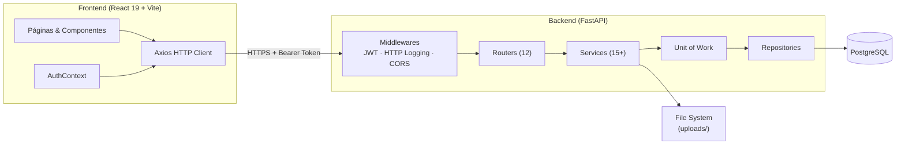
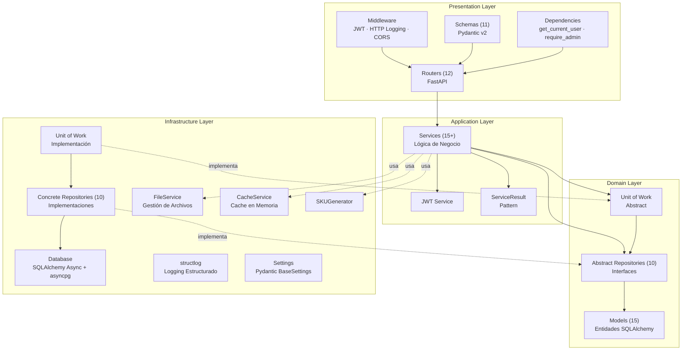
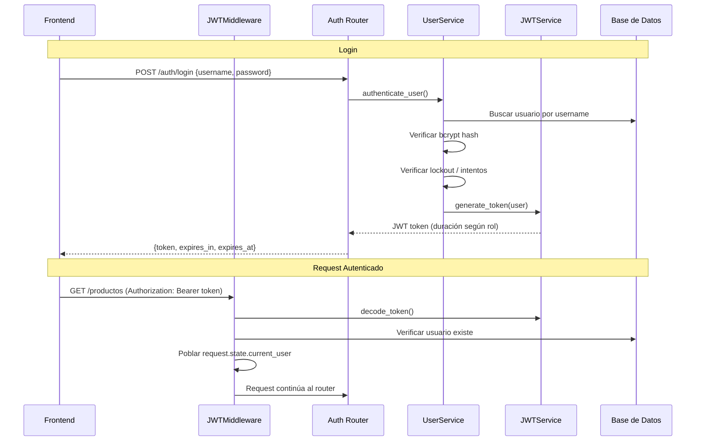
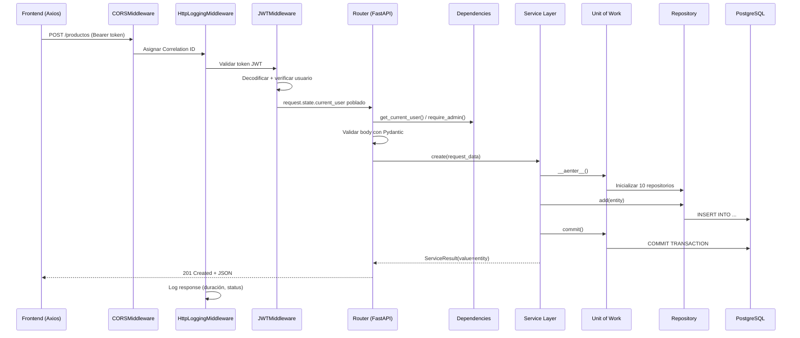

# Arquitectura del Proyecto PizzaFiori

## Descripción General

PizzaFiori es un sistema **full-stack** para la gestión integral de una pizzería, construido con:

- **Backend:** FastAPI (Python, async) con Clean Architecture
- **Frontend:** React 19 + TypeScript + Vite
- **Base de Datos:** PostgreSQL con SQLAlchemy 2.0 (async, driver asyncpg)
- **Autenticación:** JWT con bcrypt y control de acceso por roles (RBAC)

El backend sigue los principios de **Clean Architecture**, separando responsabilidades en capas independientes. El frontend consume la API REST y provee una interfaz moderna con soporte de tema claro/oscuro.

---

## Arquitectura General del Sistema



---

# Backend

## Arquitectura por Capas (Clean Architecture)

```
┌─────────────────────────────────────────────────────────┐
│         Presentation Layer (API + Middleware)           │
│  Routers (FastAPI) · Schemas (Pydantic) · Middleware   │
└─────────────────────────────────────────────────────────┘
                          ↓
┌─────────────────────────────────────────────────────────┐
│            Application Layer (Casos de Uso)             │
│  Services · ServiceResult · Analytics · JWT Service    │
└─────────────────────────────────────────────────────────┘
                          ↓
┌─────────────────────────────────────────────────────────┐
│              Domain Layer (Reglas de Negocio)           │
│  Models (15 entidades) · Abstract Repositories (10)    │
│  Abstract Unit of Work                                 │
└─────────────────────────────────────────────────────────┘
                          ↓
┌─────────────────────────────────────────────────────────┐
│        Infrastructure Layer (Implementaciones)          │
│  Database · Repositories · UoW · FileService           │
│  CacheService · SKUGenerator · Logging · Config        │
└─────────────────────────────────────────────────────────┘
```

### Diagrama de Capas



## Descripción de Capas

### 1. Presentation Layer (Capa de Presentación)

**Ubicación:** `backend/app/presentation/`

**Responsabilidades:**
- Manejar peticiones HTTP entrantes
- Validar datos de entrada con Pydantic v2
- Serializar respuestas
- Autenticación y autorización vía middleware y dependencies
- Logging de requests/responses

**Componentes:**

#### Routers (`routers/`) — 12 routers

| Router | Archivo | Descripción |
|--------|---------|-------------|
| Auth | `auth_router.py` | Login, generación de tokens |
| Users | `user_router.py` | Perfil de usuario, cambio de contraseña |
| Products | `product_router.py` | CRUD de productos con imágenes |
| Product Categories | `product_category_router.py` | Gestión de categorías de productos |
| Offers | `offer_router.py` | CRUD de ofertas/combos |
| Sales | `sale_router.py` | Registro y consulta de ventas |
| Dashboard | `dashboard_router.py` | Métricas y analytics |
| Expenses | `expense_router.py` | CRUD de gastos |
| Expense Categories | `expense_category_router.py` | Categorías de gastos |
| Audit | `audit_router.py` | Consulta de logs de auditoría |
| Stock | `stock_router.py` | Gestión de stock por categoría |
| Health | `health_router.py` | Health check del sistema |

#### Schemas (`schemas/`) — 11 archivos

Modelos Pydantic v2 con patrón `*CreateRequest`, `*UpdateRequest`, `*Response`:

`auth_schemas.py` · `user_schemas.py` · `product_schemas.py` · `product_category_schemas.py` · `offer_schemas.py` · `sale_schemas.py` · `dashboard_schemas.py` · `expense_schemas.py` · `expense_category_schemas.py` · `stock_schemas.py` · `audit_schemas.py`

#### Middleware — 3 capas (en orden de ejecución)

```python
# 1. JWT Authentication
app.add_middleware(JWTMiddleware, logger=get_logger("auth.jwt"))

# 2. HTTP Request/Response Logging
app.add_middleware(HttpLoggingMiddleware, logger=get_logger("http.external"), ...)

# 3. CORS
app.add_middleware(CORSMiddleware, allow_origins=["https://localhost:5173"], ...)
```

| Middleware | Ubicación | Responsabilidad |
|------------|-----------|-----------------|
| `JWTMiddleware` | `presentation/middleware/jwt_middleware.py` | Valida Bearer tokens, popula `request.state.current_user`. Rutas públicas: `/health`, `/auth/login`, `/docs`, `/openapi.json` |
| `HttpLoggingMiddleware` | `infrastructure/middleware/http_logging_middleware.py` | Correlation IDs (UUID), logging de request/response, redacción de headers sensibles, tracking de duración |
| `CORSMiddleware` | FastAPI built-in | Permite origen `https://localhost:5173` con credenciales |

#### Dependencies (`routers/dependencies.py`)

```python
def get_current_user(request: Request) -> dict:
    """Retorna el usuario autenticado desde request.state.current_user"""
    # Returns: {"id": int, "username": str, "role": str}

def require_admin(request: Request) -> dict:
    """Requiere rol ADMIN, retorna 403 si no cumple"""
```

### 2. Application Layer (Capa de Aplicación)

**Ubicación:** `backend/app/application/`

**Responsabilidades:**
- Contener la lógica de negocio
- Coordinar operaciones entre repositorios
- Validar reglas de negocio
- Manejar transacciones a través del Unit of Work
- Registrar auditoría de cambios

**Servicios — 15+ servicios:**

| Servicio | Archivo | Responsabilidad |
|----------|---------|-----------------|
| `UserService` | `user_service.py` | Autenticación, registro, password policy, account lockout |
| `JWTService` | `services/jwt_service.py` | Generación y validación de tokens JWT con duración por rol |
| `ProductService` | `product_service.py` | CRUD productos, manejo de imágenes, SKU auto-generado |
| `ProductCategoryService` | `product_category_service.py` | CRUD categorías de productos |
| `OfferService` | `offer_service.py` | CRUD ofertas/combos con items |
| `SaleService` | `sale_service.py` | Registro de ventas, numeración diaria |
| `DashboardService` | `dashboard_service.py` | KPIs y métricas generales |
| `SalesAnalyticsService` | `sales_analytics_service.py` | Analytics de ventas (períodos, tendencias) |
| `ProductAnalyticsService` | `product_analytics_service.py` | Analytics de productos (top ventas, categorías) |
| `ExpenseAnalyticsService` | `expense_analytics_service.py` | Analytics de gastos |
| `ExpenseService` | `expense_service.py` | CRUD de gastos |
| `ExpenseCategoryService` | `expense_category_service.py` | CRUD categorías de gastos |
| `StockService` | `stock_service.py` | Gestión de stock por categoría |
| `ReportService` | `report_service.py` | Generación de reportes |
| `AuditService` | `audit_service.py` | Registro de logs de auditoría |

**Utilidades:**
- `analytics_utils.py` — Funciones compartidas de análisis
- `utils/` — Utilidades auxiliares de los servicios

**Patrón ServiceResult:**

Todos los servicios retornan un `ServiceResult` para manejo consistente de éxito y errores:

```python
@dataclass
class ServiceResult:
    value: Optional[Any] = None    # Dato de retorno en caso de éxito
    error: Optional[str] = None    # Mensaje de error
    status_code: int = 200         # Código HTTP sugerido
```

**Inyección de dependencias en servicios:**

Cada servicio recibe sus dependencias vía constructor (inyectadas por el Container):

```python
class ProductService:
    def __init__(self, uow, file_service, cache_service, audit_service, logger):
        self.uow = uow
        self.file_service = file_service
        self.cache_service = cache_service
        self.audit_service = audit_service
        self.logger = logger
```

### 3. Domain Layer (Capa de Dominio)

**Ubicación:** `backend/app/domain/`

**Responsabilidades:**
- Definir entidades del dominio
- Definir interfaces abstractas de repositorios
- Definir el contrato del Unit of Work
- No tener dependencias de infraestructura

#### Modelos (`models/`) — 15 entidades

| Modelo | Archivo | Descripción |
|--------|---------|-------------|
| `Base` | `base.py` | Clase base SQLAlchemy declarativa |
| `User` | `user.py` | Usuarios con roles (ADMIN/USER), intentos de login, lockout |
| `Product` | `product.py` | Productos con SKU, precio, imagen |
| `ProductCategory` | `product_category.py` | Categorías de productos |
| `ProductPrice` | `product_price.py` | Historial de precios de productos |
| `Sale` | `sale.py` | Ventas con total, fecha, usuario |
| `SaleItem` | `sale_item.py` | Items individuales de una venta |
| `SaleItemOfferProduct` | `sale_item_offer_product.py` | Productos dentro de ofertas vendidas |
| `Offer` | `offer.py` | Ofertas/combos con precio especial |
| `OfferItem` | `offer_item.py` | Items que componen una oferta |
| `Expense` | `expense.py` | Gastos registrados |
| `ExpenseCategory` | `expense_category.py` | Categorías de gastos |
| `AuditLog` | `audit_log.py` | Registro de auditoría de cambios |
| `CategoryStock` | `category_stock.py` | Stock por categoría de producto |
| `OrderDailySequence` | `order_daily_sequence.py` | Secuencia diaria de numeración de pedidos |

#### Repositorios Abstractos (`repositories/`) — 10 interfaces

| Repositorio | Archivo |
|-------------|---------|
| `AbstractProductRepository` | `product_repository.py` |
| `AbstractProductCategoryRepository` | `product_category_repository.py` |
| `AbstractOfferRepository` | `offer_repository.py` |
| `AbstractSaleRepository` | `sale_repository.py` |
| `AbstractSequenceRepository` | `sequence_repository.py` |
| `AbstractUserRepository` | `user_repository.py` |
| `AbstractAuditRepository` | `audit_repository.py` |
| `AbstractExpenseCategoryRepository` | `expense_category_repository.py` |
| `AbstractExpenseRepository` | `expense_repository.py` |
| `AbstractCategoryStockRepository` | `abstract_category_stock_repository.py` |

#### Unit of Work Abstracto (`unit_of_work.py`)

Define el contrato transaccional con los 10 repositorios:

```python
class AbstractUnitOfWork(ABC):
    product_repo: AbstractProductRepository
    product_category_repo: AbstractProductCategoryRepository
    offer_repo: AbstractOfferRepository
    sale_repo: AbstractSaleRepository
    sequence_repo: AbstractSequenceRepository
    users: AbstractUserRepository
    audit_repo: AbstractAuditRepository
    expense_category_repo: AbstractExpenseCategoryRepository
    expense_repo: AbstractExpenseRepository
    stock_repo: AbstractCategoryStockRepository

    async def __aenter__(self): ...
    async def __aexit__(self, *args): await self.rollback()
    async def commit(self) -> None: ...
    async def rollback(self) -> None: ...
```

### 4. Infrastructure Layer (Capa de Infraestructura)

**Ubicación:** `backend/app/infrastructure/`

**Responsabilidades:**
- Implementar las abstracciones definidas en Domain
- Gestionar acceso a base de datos
- Manejar servicios externos (archivos, cache, logging)
- Configuración del sistema

**Componentes:**

| Componente | Archivo/Carpeta | Descripción |
|------------|-----------------|-------------|
| **Database** | `database.py` | Configuración SQLAlchemy async con asyncpg, `AsyncSessionLocal` |
| **Repositories** | `repositories/` | 10 implementaciones concretas + `base.py` genérico |
| **Unit of Work** | `unit_of_work.py` | `SqlAlchemyUnitOfWork` — implementación concreta con 10 repos |
| **FileService** | `file_service.py` | Gestión de archivos subidos en `/uploads` |
| **CacheService** | `cache/cache_service.py` | Cache en memoria para categorías, ofertas, etc. |
| **SKUGenerator** | `sku_generator.py` | Generación automática de SKUs basada en nombre y categoría |
| **Config** | `config/settings.py` | `Settings` con Pydantic BaseSettings (ver sección Configuración) |
| **Logging** | `logging.py` | structlog con correlation IDs, rotating files, redacción de datos sensibles |
| **HTTP Logging MW** | `middleware/http_logging_middleware.py` | Middleware de logging de requests/responses |

#### BaseRepository Genérico (`repositories/base.py`)

Todas las implementaciones extienden `BaseRepository[T]` que provee operaciones CRUD genéricas:

```python
class BaseRepository(Generic[T]):
    async def add(self, entity: T) -> T: ...
    async def get_by_id(self, id: int) -> Optional[T]: ...
    async def list(self, **filters) -> List[T]: ...
    async def update(self, entity: T) -> T: ...
    async def delete(self, entity: T) -> None: ...
    async def refresh(self, entity: T) -> T: ...
    async def count(self, **filters) -> int: ...
```

## Patrones de Diseño Implementados

### 1. Repository Pattern

**Propósito:** Abstraer el acceso a datos y facilitar el cambio de implementación.

**Implementación:**
- **Abstract Repository** (Domain): Define el contrato (10 interfaces)
- **Concrete Repository** (Infrastructure): Implementa con SQLAlchemy (10 + base genérico)

**Beneficios:**
- Desacopla la lógica de negocio del acceso a datos
- Facilita las pruebas unitarias (mocks)
- Permite cambiar la implementación sin afectar el dominio

### 2. Unit of Work Pattern

**Propósito:** Gestionar transacciones y mantener consistencia de datos.

**Implementación:**
- **AbstractUnitOfWork** (Domain): Interfaz con 10 repositorios
- **SqlAlchemyUnitOfWork** (Infrastructure): Implementación con auto-rollback en excepciones

**Uso:**
```python
async with self.uow as uow:
    await uow.product_repo.add(product)
    await uow.sale_repo.add(sale)
    await uow.commit()  # Todo o nada — rollback automático si hay excepción
```

### 3. Dependency Injection

**Propósito:** Invertir el control de dependencias y facilitar el testing.

**Implementación:**
- Usa `dependency-injector` con un `Container` declarativo
- Singletons: `logging`, `file_service`, `cache_service`
- Factories: `unit_of_work`, todos los servicios de negocio
- Auto-wiring en 11 módulos de routers vía decorador `@inject`

```python
class Container(containers.DeclarativeContainer):
    logging = providers.Singleton(configure_logging)
    file_service = providers.Singleton(FileService)
    cache_service = providers.Singleton(CacheService)
    unit_of_work = providers.Factory(SqlAlchemyUnitOfWork)

    product_service = providers.Factory(
        ProductService,
        uow=unit_of_work,
        file_service=file_service,
        cache_service=cache_service,
        audit_service=audit_service,
        logger=logging,
    )
    # ... 14 servicios más
```

### 4. Service Layer Pattern

**Propósito:** Centralizar la lógica de negocio y coordinar operaciones.

**Implementación:**
- Cada dominio tiene su servicio correspondiente (15+ servicios)
- Los servicios coordinan repositorios, aplican reglas de negocio y registran auditoría
- Todos retornan `ServiceResult` (Result Pattern)

### 5. Result Pattern (ServiceResult)

**Propósito:** Manejo consistente de éxito y errores sin excepciones.

```python
result = await service.create(data)
if result.error:
    raise HTTPException(status_code=result.status_code, detail=result.error)
return result.value
```

---

## Autenticación y Seguridad

### Flujo de Autenticación



### Políticas de Seguridad

| Política | Configuración |
|----------|---------------|
| **Password mínimo** | 8 caracteres |
| **Password requiere mayúsculas** | Sí |
| **Password requiere números** | Sí |
| **Hash algorithm** | bcrypt (rounds=12) |
| **Max intentos de login** | 5 intentos |
| **Duración lockout** | 30 minutos |
| **Token ADMIN** | 1 hora |
| **Token USER** | 24 horas |
| **Algoritmo JWT** | HS256 |
| **Roles** | ADMIN, USER |

---

## Configuración del Sistema

Gestionada con **Pydantic BaseSettings** en `backend/app/infrastructure/config/settings.py`, carga variables desde `.env`:

```python
class Settings(BaseSettings):
    # App
    app_name: str
    env: str                          # development / production
    debug: bool

    # Database (PostgreSQL)
    db_host, db_name, db_user, db_password, db_port

    # JWT
    jwt_secret: str
    jwt_algorithm: str = "HS256"
    jwt_token_durations: Dict[str, int] = {"ADMIN": 60, "USER": 1440}

    # Password Policy
    password_min_length: int = 8
    password_require_uppercase: bool = True
    password_require_numbers: bool = True

    # Login Security
    max_login_attempts: int = 5
    lockout_duration_minutes: int = 30

    # Rate Limiting
    rate_limit_enabled: bool = True

    # SSL/TLS (opcional)
    ssl_key_file: Optional[str] = None
    ssl_cert_file: Optional[str] = None
```

---

## Sistema de Logging

Implementado con **structlog** para logging estructurado en JSON:

- **Correlation IDs**: UUID único por request, propagado vía `contextvars`
- **Rotating file handlers**: `app.log` (general) y `app-http.log` (requests HTTP)
- **Redacción de datos sensibles**: Headers `Authorization`, `Cookie`, `X-API-Key`, `X-CSRF-Token` se redactan automáticamente
- **Processors**: `merge_contextvars`, `add_log_level`, `add_logger_name`, `add_app_context`
- **Modo debug**: incluye logging del body de responses
- **Dual output**: consola + archivos rotativos

---

## Flujo de una Petición HTTP



---

# Frontend

## Stack Tecnológico

| Tecnología | Versión | Uso |
|------------|---------|-----|
| **React** | 19.2 | Framework UI |
| **TypeScript** | 5.9 | Tipado estático |
| **Vite** | 7.2 | Build tool y dev server |
| **React Router** | 7.12 | Routing SPA |
| **Axios** | 1.13 | Cliente HTTP |
| **Recharts** | 3.7 | Gráficos y charts |
| **Framer Motion** | 12.26 | Animaciones |
| **Lucide React** | 0.542 | Iconos |
| **react-datepicker** | 9.1 | Selector de fechas |

## Arquitectura del Frontend

```
frontend/src/
├── main.tsx                # Entry point — React.createRoot + StrictMode
├── App.tsx                 # BrowserRouter + Routes + AuthProvider
├── index.css               # Estilos globales + variables CSS (light/dark)
│
├── pages/                  # Componentes de página (1 por ruta)
├── components/             # Componentes reutilizables
│   ├── layout/             #   AppLayout, Sidebar
│   ├── Dashboard/          #   13 componentes de charts y KPIs
│   ├── shared/             #   17 componentes UI reutilizables
│   └── [modals, cards...]  #   Modales y formularios específicos
│
├── services/               # 14 servicios de API (capa de datos)
├── contexts/               # React Context (AuthContext)
├── hooks/                  # Custom hooks (useGenerateReport)
├── types/                  # 11 archivos de tipos TypeScript
├── utils/                  # Formatters, validación, persistencia
├── constants/              # Mensajes de validación
├── config/                 # Configuración (env.ts)
├── styles/                 # Estilos por componente
└── assets/                 # Imágenes (logo, etc.)
```

## Routing

Definido en `App.tsx` con React Router v7:

**Ruta pública:**
| Ruta | Página | Descripción |
|------|--------|-------------|
| `/login` | `LoginPage` | Inicio de sesión |

**Rutas protegidas** (envueltas en `ProtectedRoute` + `AppLayout`):

| Ruta | Página | Acceso |
|------|--------|--------|
| `/` | `HomePage` | Todos |
| `/registrar-venta` | `SalesCreatePage` | Todos |
| `/ventas` | `SalesPage` | Todos |
| `/stock` | `StockPage` | Todos |
| `/productos` | `ProductosPage` | Admin |
| `/ofertas` | `OffersPage` | Admin |
| `/gastos` | `ExpensesPage` | Admin |
| `/dashboard` | `DashboardOverview` | Admin |
| `/reportes` | `ReportsPage` | Admin |
| `/auditoria` | `AuditPage` | Admin |
| `/admin/users` | `UserManagementPage` | Admin |
| `/profile` | `UserProfilePage` | Todos |

## State Management

**React Context API** (sin Redux/Zustand):

- **`AuthContext`** (`contexts/AuthContext.tsx`): Estado global de autenticación
  - Provee: `user`, `isAuthenticated`, `isLoading`, `login()`, `logout()`, `register()`
  - Persiste estado en `localStorage`
  - Hook: `useAuth()`

- **Estado local**: Cada página maneja su propio estado con `useState`/`useEffect`
- **`usePersistentState`**: Hook custom para persistir estado en `localStorage` (tema, sidebar)

## Capa de Servicios (API Client)

### Cliente HTTP (`services/http.ts`)

Basado en **Axios** con configuración centralizada:

- **Base URL**: configurable vía `VITE_API_BASE_URL`
- **Request Interceptor**: Agrega `Authorization: Bearer <token>`, verifica expiración del token
- **Response Interceptor**: Maneja errores 401/403, traduce mensajes de error (inglés → español)

### Servicios de API — 14 archivos

| Servicio | Archivo | Endpoint base |
|----------|---------|---------------|
| Auth | `authService.ts` | `/auth` |
| Products | `productsService.ts` | `/productos` |
| Product Categories | `productosCategoriasService.ts` | `/categorias-productos` |
| Sales | `salesService.ts` | `/ventas` |
| Offers | `ofertasService.ts` | `/ofertas` |
| Dashboard | `dashboardService.ts` | `/dashboard` |
| Reports | `reportService.ts` | `/reportes` |
| Stock | `stockService.ts` | `/stock` |
| Expenses | `gastosService.ts` | `/gastos` |
| Expense Categories | `gastosCategoriasService.ts` | `/categorias-gastos` |
| Users | `userService.ts` | `/users` |
| User Management | `userManagementService.ts` | `/users` |
| Audit | `auditService.ts` | `/auditoria` |

## Componentes de Dashboard

13 componentes especializados para visualización de datos:

**Charts (Recharts):**
- `RevenueChart` — Área/Barras de ingresos (diario/semanal/mensual/anual)
- `SalesByCategoryChart` — Torta de ventas por categoría
- `WeekdayChart` — Barras de rendimiento por día de la semana
- `ExpenseByMonthChart` — Línea/Área de gastos mensuales
- `ExpenseByCategoryChart` — Torta de gastos por categoría
- `MonthlyBalanceBarChart` — Barras de balance mensual (ganancia/pérdida)
- `NetMarginLineChart` — Línea de margen neto porcentual

**Tablas:**
- `TopProductsTable` — Top productos más vendidos

**KPIs:**
- `TotalSalesKPICard` · `TotalOrdersKPICard` · `TotalExpensesKPICard` · `NetProfitKPICard` · `NetMarginKPICard`

## Sistema de Diseño

- **CSS custom** con variables CSS (sin framework UI externo)
- **Tema claro/oscuro**: variables `--color-surface-*`, `--color-border-*`, etc.
- **Toggle de tema**: persistido en `localStorage` (`ui-theme`)
- **Responsive**: diseño adaptable con mobile-first
- **Componentes shared**: 17 componentes reutilizables (Badge, ConfirmDialog, ChartWrapper, FilterBar, SearchableSelect, SkeletonLoader, etc.)

## Navegación (Sidebar)

**Items comunes (todos los usuarios):**
- Inicio · Registrar Venta · Ventas · Stock

**Items solo Admin:**
- Ofertas · Productos · Gastos · Dashboard · Reportes · Auditoría · Gestión Usuarios

Sidebar colapsable con estado persistido en `localStorage`.

---

# Estructura de Directorios Completa

```
PizzaFiori/
├── package.json                          # Config raíz del proyecto
│
├── backend/
│   ├── requirements.txt                  # Dependencias Python
│   ├── alembic.ini                       # Config de migraciones
│   ├── seeds.py                          # Datos iniciales
│   ├── pytest.ini                        # Config de tests
│   │
│   ├── alembic/                          # Migraciones de BD
│   │   ├── env.py
│   │   └── versions/
│   │
│   ├── app/
│   │   ├── main.py                       # Entry point FastAPI
│   │   ├── containers.py                 # Dependency Injection Container
│   │   │
│   │   ├── domain/                       # Domain Layer
│   │   │   ├── models/                   #   15 entidades SQLAlchemy
│   │   │   │   ├── base.py
│   │   │   │   ├── user.py
│   │   │   │   ├── product.py
│   │   │   │   ├── product_category.py
│   │   │   │   ├── product_price.py
│   │   │   │   ├── sale.py
│   │   │   │   ├── sale_item.py
│   │   │   │   ├── sale_item_offer_product.py
│   │   │   │   ├── offer.py
│   │   │   │   ├── offer_item.py
│   │   │   │   ├── expense.py
│   │   │   │   ├── expense_category.py
│   │   │   │   ├── audit_log.py
│   │   │   │   ├── category_stock.py
│   │   │   │   └── order_daily_sequence.py
│   │   │   │
│   │   │   ├── repositories/             #   10 repositorios abstractos
│   │   │   │   ├── product_repository.py
│   │   │   │   ├── product_category_repository.py
│   │   │   │   ├── offer_repository.py
│   │   │   │   ├── sale_repository.py
│   │   │   │   ├── sequence_repository.py
│   │   │   │   ├── user_repository.py
│   │   │   │   ├── audit_repository.py
│   │   │   │   ├── expense_category_repository.py
│   │   │   │   ├── expense_repository.py
│   │   │   │   └── abstract_category_stock_repository.py
│   │   │   │
│   │   │   └── unit_of_work.py           #   UoW abstracto
│   │   │
│   │   ├── application/                  # Application Layer
│   │   │   ├── user_service.py
│   │   │   ├── product_service.py
│   │   │   ├── product_category_service.py
│   │   │   ├── offer_service.py
│   │   │   ├── sale_service.py
│   │   │   ├── dashboard_service.py
│   │   │   ├── sales_analytics_service.py
│   │   │   ├── product_analytics_service.py
│   │   │   ├── expense_analytics_service.py
│   │   │   ├── expense_service.py
│   │   │   ├── expense_category_service.py
│   │   │   ├── stock_service.py
│   │   │   ├── report_service.py
│   │   │   ├── audit_service.py
│   │   │   ├── analytics_utils.py
│   │   │   ├── services/
│   │   │   │   └── jwt_service.py
│   │   │   └── utils/
│   │   │
│   │   ├── presentation/                 # Presentation Layer
│   │   │   ├── routers/                  #   12 routers + dependencies
│   │   │   │   ├── auth_router.py
│   │   │   │   ├── user_router.py
│   │   │   │   ├── product_router.py
│   │   │   │   ├── product_category_router.py
│   │   │   │   ├── offer_router.py
│   │   │   │   ├── sale_router.py
│   │   │   │   ├── dashboard_router.py
│   │   │   │   ├── expense_router.py
│   │   │   │   ├── expense_category_router.py
│   │   │   │   ├── audit_router.py
│   │   │   │   ├── stock_router.py
│   │   │   │   ├── health_router.py
│   │   │   │   └── dependencies.py
│   │   │   │
│   │   │   ├── schemas/                  #   11 archivos de schemas
│   │   │   │   ├── auth_schemas.py
│   │   │   │   ├── user_schemas.py
│   │   │   │   ├── product_schemas.py
│   │   │   │   ├── product_category_schemas.py
│   │   │   │   ├── offer_schemas.py
│   │   │   │   ├── sale_schemas.py
│   │   │   │   ├── dashboard_schemas.py
│   │   │   │   ├── expense_schemas.py
│   │   │   │   ├── expense_category_schemas.py
│   │   │   │   ├── stock_schemas.py
│   │   │   │   └── audit_schemas.py
│   │   │   │
│   │   │   └── middleware/
│   │   │       └── jwt_middleware.py
│   │   │
│   │   └── infrastructure/               # Infrastructure Layer
│   │       ├── database.py
│   │       ├── unit_of_work.py
│   │       ├── file_service.py
│   │       ├── sku_generator.py
│   │       ├── logging.py
│   │       ├── repositories/             #   10 implementaciones + base
│   │       │   ├── base.py
│   │       │   ├── product_repository.py
│   │       │   ├── product_category_repository.py
│   │       │   ├── offer_repository.py
│   │       │   ├── sale_repository.py
│   │       │   ├── sequence_repository.py
│   │       │   ├── user_repository.py
│   │       │   ├── audit_repository.py
│   │       │   ├── expense_category_repository.py
│   │       │   ├── expense_repository.py
│   │       │   └── category_stock_repository.py
│   │       ├── cache/
│   │       │   └── cache_service.py
│   │       ├── config/
│   │       │   └── settings.py
│   │       └── middleware/
│   │           └── http_logging_middleware.py
│   │
│   ├── tests/                            # Tests (pytest)
│   ├── uploads/                          # Archivos subidos
│   ├── logs/                             # Logs rotativos
│   └── certs/                            # Certificados SSL
│
├── frontend/
│   ├── package.json                      # Dependencias npm
│   ├── vite.config.ts                    # Config Vite
│   ├── tsconfig.json                     # Config TypeScript
│   ├── eslint.config.js                  # Config ESLint
│   ├── index.html                        # HTML entry point
│   │
│   └── src/
│       ├── main.tsx                      # React entry point
│       ├── App.tsx                       # Router + AuthProvider
│       ├── index.css                     # Variables CSS + temas
│       │
│       ├── pages/                        # 14 páginas
│       │   ├── LoginPage.tsx
│       │   ├── HomePage.tsx
│       │   ├── ProductsPage.tsx
│       │   ├── OffersPage.tsx
│       │   ├── SalesPage.tsx
│       │   ├── SalesCreate.tsx
│       │   ├── DashboardOverview.tsx
│       │   ├── ReportsPage.tsx
│       │   ├── AuditPage.tsx
│       │   ├── ExpensesPage.tsx
│       │   ├── ExpenseCategoriesPage.tsx
│       │   ├── StockPage.tsx
│       │   ├── UserProfilePage.tsx
│       │   └── UserManagementPage.tsx
│       │
│       ├── components/
│       │   ├── layout/                   # AppLayout, Sidebar
│       │   ├── Dashboard/               # 13 componentes (charts + KPIs)
│       │   ├── shared/                  # 17 componentes UI reutilizables
│       │   ├── ProtectedRoute.tsx
│       │   └── [modales, cards, forms]
│       │
│       ├── services/                     # 14 servicios API
│       │   ├── http.ts                  # Config Axios base
│       │   ├── authService.ts
│       │   ├── productsService.ts
│       │   └── ...
│       │
│       ├── contexts/                     # AuthContext.tsx
│       ├── hooks/                        # useGenerateReport
│       ├── types/                        # 11 archivos de tipos TS
│       ├── utils/                        # formatters, validation
│       ├── constants/                    # Mensajes de validación
│       ├── config/                       # env.ts (VITE_API_BASE_URL)
│       ├── styles/                       # Estilos por componente
│       └── assets/                       # Logo, imágenes
│
└── docs/                                 # Documentación del proyecto
    ├── ARQUITECTURA.md
    ├── API.md
    ├── DIAGRAMA_BASE_DATOS.md
    ├── GUIA_CREAR_ENDPOINT.md
    ├── GUIA_CREAR_PAGINA_FRONTEND.md
    ├── GUIA_UX_COLORES.md
    ├── INSTALACION.md
    ├── LOGICA_GRAFICOS.md
    ├── TESTING.md
    └── README.md
```

---

## Principios de Diseño

### 1. Separación de Responsabilidades
Cada capa tiene una responsabilidad única y bien definida. El frontend y backend están completamente desacoplados, comunicándose exclusivamente vía API REST.

### 2. Inversión de Dependencias
Las capas internas (Domain, Application) no dependen de las externas (Infrastructure, Presentation). Las dependencias apuntan hacia adentro.

### 3. Independencia de Frameworks
El dominio no depende de FastAPI, SQLAlchemy u otros frameworks. Los modelos definen el negocio, los repositorios abstractos definen contratos.

### 4. Testabilidad
La arquitectura facilita las pruebas unitarias mediante abstracciones y dependency injection. Los servicios reciben sus dependencias por constructor, permitiendo inyectar mocks.

### 5. Mantenibilidad
Código organizado y estructurado con convenciones claras. Agregar un nuevo módulo sigue el mismo patrón en todas las capas.

---

## Ventajas de esta Arquitectura

✅ **Escalabilidad**: Fácil agregar nuevos módulos siguiendo el mismo patrón  
✅ **Mantenibilidad**: Código organizado y fácil de entender  
✅ **Testabilidad**: Abstracciones permiten mockear dependencias  
✅ **Flexibilidad**: Cambiar implementaciones sin afectar el dominio  
✅ **Consistencia**: Patrones claros y bien definidos en todas las capas  
✅ **Seguridad**: JWT + RBAC + password policy + account lockout + correlation IDs  
✅ **Observabilidad**: Logging estructurado con correlation IDs y redacción de datos sensibles  

---

## Referencias

- [Clean Architecture - Robert C. Martin](https://blog.cleancoder.com/uncle-bob/2012/08/13/the-clean-architecture.html)
- [FastAPI Documentation](https://fastapi.tiangolo.com/)
- [SQLAlchemy 2.0 Async](https://docs.sqlalchemy.org/en/20/orm/extensions/asyncio.html)
- [Dependency Injector](https://python-dependency-injector.ets-labs.org/)
- [React 19](https://react.dev/)
- [Vite](https://vite.dev/)
- [Recharts](https://recharts.org/)
- [structlog](https://www.structlog.org/)
- [Pydantic Settings](https://docs.pydantic.dev/latest/concepts/pydantic_settings/)
