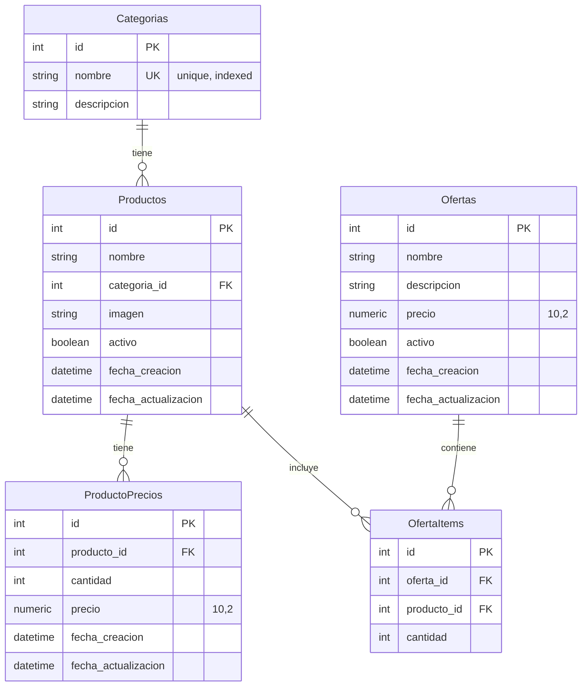

# Diagrama de Base de Datos - PizzaFiori

## Descripción General

La base de datos de PizzaFiori está diseñada para gestionar productos, categorías, precios y ofertas de una pizzería. Utiliza SQL Server (MSSQL) como motor de base de datos y SQLAlchemy como ORM.

## Diagrama Entidad-Relación



## Descripción de Entidades

### 1. Categorias

**Tabla:** `Categorias`

**Descripción:** Representa las categorías de productos (ej: Pizzas, Bebidas, Postres, etc.)

**Campos:**

| Campo | Tipo | Restricciones | Descripción |
|-------|------|---------------|-------------|
| `id` | INTEGER | PRIMARY KEY | Identificador único de la categoría |
| `nombre` | VARCHAR(50) | NOT NULL, UNIQUE, INDEXED | Nombre de la categoría (único) |
| `descripcion` | VARCHAR(255) | NULLABLE | Descripción opcional de la categoría |

**Relaciones:**
- **Uno a Muchos** con `Productos`: Una categoría puede tener múltiples productos

**Ejemplo de datos:**
```
id | nombre    | descripcion
---|-----------|------------
1  | Pizzas    | Pizzas de todos los gustos
2  | Bebidas   | Bebidas frías y calientes
3  | Postres   | Postres caseros
```

### 2. Productos

**Tabla:** `Productos`

**Descripción:** Representa los productos disponibles en la pizzería (pizzas, bebidas, postres, etc.)

**Campos:**

| Campo | Tipo | Restricciones | Descripción |
|-------|------|---------------|-------------|
| `id` | INTEGER | PRIMARY KEY, AUTO_INCREMENT | Identificador único del producto |
| `nombre` | VARCHAR(255) | NOT NULL | Nombre del producto |
| `categoria_id` | INTEGER | FOREIGN KEY, NULLABLE | ID de la categoría a la que pertenece |
| `imagen` | VARCHAR(255) | NULLABLE | Ruta de la imagen del producto |
| `activo` | BOOLEAN | NOT NULL, DEFAULT TRUE | Indica si el producto está activo/disponible |
| `fecha_creacion` | DATETIME | DEFAULT NOW() | Fecha de creación del registro |
| `fecha_actualizacion` | DATETIME | DEFAULT NOW() | Fecha de última actualización |

**Relaciones:**
- **Muchos a Uno** con `Categorias`: Un producto pertenece a una categoría (opcional)
- **Uno a Muchos** con `ProductoPrecios`: Un producto puede tener múltiples precios
- **Uno a Muchos** con `OfertaItems`: Un producto puede estar en múltiples ofertas

**Índices:**
- `ix_Productos_id`: Índice en el campo `id`

**Ejemplo de datos:**
```
id | nombre          | categoria_id | imagen                    | activo | fecha_creacion
---|-----------------|--------------|---------------------------|--------|---------------
1  | Muzzarella      | 1            | productos/muzzarella.jpg   | true   | 2026-01-19
2  | Coca Cola 1.5L  | 2            | productos/coca_cola.jpg   | true   | 2026-01-19
3  | Tiramisú        | 3            | productos/tiramisu.jpg    | true   | 2026-01-19
```

### 3. ProductoPrecios

**Tabla:** `ProductoPrecios`

**Descripción:** Almacena los precios escalonados de cada producto según la cantidad (ej: precio por unidad, precio por docena)

**Campos:**

| Campo | Tipo | Restricciones | Descripción |
|-------|------|---------------|-------------|
| `id` | INTEGER | PRIMARY KEY, AUTO_INCREMENT | Identificador único del precio |
| `producto_id` | INTEGER | FOREIGN KEY, NOT NULL | ID del producto al que pertenece el precio |
| `cantidad` | INTEGER | NOT NULL | Cantidad de unidades para este precio |
| `precio` | NUMERIC(10,2) | NOT NULL | Precio para la cantidad especificada |
| `fecha_creacion` | DATETIME | DEFAULT NOW() | Fecha de creación del registro |
| `fecha_actualizacion` | DATETIME | DEFAULT NOW() | Fecha de última actualización |

**Relaciones:**
- **Muchos a Uno** con `Productos`: Un precio pertenece a un producto

**Índices:**
- `ix_ProductoPrecios_id`: Índice en el campo `id`

**Ejemplo de datos:**
```
id | producto_id | cantidad | precio  | fecha_creacion
---|-------------|----------|---------|---------------
1  | 1           | 1        | 1200.00 | 2026-01-19
2  | 1           | 2        | 2200.00 | 2026-01-19
3  | 2           | 1        | 800.00  | 2026-01-19
```

**Nota:** Un producto puede tener múltiples precios según la cantidad. Por ejemplo, una pizza puede costar $1200 por unidad o $2200 por dos unidades.

### 4. Ofertas

**Tabla:** `Ofertas`

**Descripción:** Representa ofertas o combos que incluyen múltiples productos a un precio especial

**Campos:**

| Campo | Tipo | Restricciones | Descripción |
|-------|------|---------------|-------------|
| `id` | INTEGER | PRIMARY KEY, AUTO_INCREMENT | Identificador único de la oferta |
| `nombre` | VARCHAR(255) | NOT NULL | Nombre de la oferta |
| `descripcion` | TEXT | NULLABLE | Descripción detallada de la oferta |
| `precio` | NUMERIC(10,2) | NOT NULL | Precio total de la oferta |
| `activo` | BOOLEAN | NOT NULL, DEFAULT TRUE | Indica si la oferta está activa/disponible |
| `fecha_creacion` | DATETIME | DEFAULT NOW() | Fecha de creación del registro |
| `fecha_actualizacion` | DATETIME | DEFAULT NOW() | Fecha de última actualización |

**Relaciones:**
- **Uno a Muchos** con `OfertaItems`: Una oferta contiene múltiples items

**Índices:**
- `ix_Ofertas_id`: Índice en el campo `id`

**Ejemplo de datos:**
```
id | nombre              | descripcion                    | precio  | activo | fecha_creacion
---|---------------------|--------------------------------|---------|--------|---------------
1  | Combo Familiar      | 2 Pizzas + 2 Bebidas           | 3500.00 | true   | 2026-01-19
2  | Pizza + Bebida      | 1 Pizza Muzzarella + 1 Bebida | 1800.00 | true   | 2026-01-19
```

### 5. OfertaItems

**Tabla:** `OfertaItems`

**Descripción:** Tabla de relación que conecta ofertas con productos, indicando qué productos y en qué cantidad forman parte de cada oferta

**Campos:**

| Campo | Tipo | Restricciones | Descripción |
|-------|------|---------------|-------------|
| `id` | INTEGER | PRIMARY KEY, AUTO_INCREMENT | Identificador único del item |
| `oferta_id` | INTEGER | FOREIGN KEY, NOT NULL | ID de la oferta |
| `producto_id` | INTEGER | FOREIGN KEY, NOT NULL | ID del producto incluido en la oferta |
| `cantidad` | INTEGER | NOT NULL, DEFAULT 1 | Cantidad del producto en la oferta |

**Relaciones:**
- **Muchos a Uno** con `Ofertas`: Un item pertenece a una oferta
- **Muchos a Uno** con `Productos`: Un item referencia un producto

**Índices:**
- `ix_OfertaItems_id`: Índice en el campo `id`

**Ejemplo de datos:**
```
id | oferta_id | producto_id | cantidad
---|-----------|-------------|----------
1  | 1         | 1           | 2        (2 Pizzas Muzzarella)
2  | 1         | 2           | 2        (2 Bebidas)
3  | 2         | 1           | 1        (1 Pizza Muzzarella)
4  | 2         | 2           | 1        (1 Bebida)
```

## Relaciones Detalladas

### Relación Categorias → Productos

- **Tipo:** Uno a Muchos (1:N)
- **Cardinalidad:** Una categoría puede tener cero o muchos productos
- **Foreign Key:** `Productos.categoria_id` → `Categorias.id`
- **Comportamiento:** Si se elimina una categoría, los productos asociados mantienen `categoria_id = NULL` (no se eliminan)

### Relación Productos → ProductoPrecios

- **Tipo:** Uno a Muchos (1:N)
- **Cardinalidad:** Un producto puede tener uno o muchos precios
- **Foreign Key:** `ProductoPrecios.producto_id` → `Productos.id`
- **Comportamiento:** Si se elimina un producto, se eliminan sus precios (CASCADE)

### Relación Ofertas → OfertaItems

- **Tipo:** Uno a Muchos (1:N)
- **Cardinalidad:** Una oferta puede tener uno o muchos items
- **Foreign Key:** `OfertaItems.oferta_id` → `Ofertas.id`
- **Comportamiento:** Si se elimina una oferta, se eliminan sus items (CASCADE)

### Relación Productos → OfertaItems

- **Tipo:** Uno a Muchos (1:N)
- **Cardinalidad:** Un producto puede estar en cero o muchas ofertas
- **Foreign Key:** `OfertaItems.producto_id` → `Productos.id`
- **Comportamiento:** Si se elimina un producto, se eliminan los items de oferta que lo referencian

## Constraints y Validaciones

### Constraints de Base de Datos

1. **Primary Keys:** Todas las tablas tienen un campo `id` como clave primaria
2. **Foreign Keys:** Todas las relaciones están definidas con foreign keys
3. **Unique Constraint:** `Categorias.nombre` es único
4. **NOT NULL:** Campos críticos como `nombre`, `precio`, `activo` son obligatorios
5. **Default Values:** 
   - `activo` tiene valor por defecto `TRUE`
   - `fecha_creacion` y `fecha_actualizacion` tienen valor por defecto `NOW()`
   - `cantidad` en `OfertaItems` tiene valor por defecto `1`

### Validaciones de Negocio (a nivel de aplicación)

1. **Productos:**
   - El nombre no puede estar vacío
   - La imagen debe ser una ruta válida si se proporciona
   - Debe tener al menos un precio asociado

2. **ProductoPrecios:**
   - La cantidad debe ser mayor a 0
   - El precio debe ser mayor a 0
   - No puede haber precios duplicados para la misma cantidad del mismo producto

3. **Ofertas:**
   - El precio debe ser mayor a 0
   - Debe tener al menos un producto asociado

4. **OfertaItems:**
   - La cantidad debe ser mayor a 0
   - El producto debe existir y estar activo

## Índices y Optimizaciones

### Índices Existentes

1. **Categorias:**
   - `ix_Categorias_nombre`: Índice único en `nombre` para búsquedas rápidas

2. **Productos:**
   - `ix_Productos_id`: Índice en `id` (automático por PRIMARY KEY)
   - Índice implícito en `categoria_id` (FOREIGN KEY)

3. **ProductoPrecios:**
   - `ix_ProductoPrecios_id`: Índice en `id`
   - Índice implícito en `producto_id` (FOREIGN KEY)

4. **Ofertas:**
   - `ix_Ofertas_id`: Índice en `id`

5. **OfertaItems:**
   - `ix_OfertaItems_id`: Índice en `id`
   - Índices implícitos en `oferta_id` y `producto_id` (FOREIGN KEYS)

### Optimizaciones Recomendadas

1. **Índice compuesto en Productos:**
   ```sql
   CREATE INDEX idx_productos_categoria_activo 
   ON Productos(categoria_id, activo);
   ```
   Útil para consultas que filtran por categoría y estado activo.

2. **Índice en ProductoPrecios:**
   ```sql
   CREATE INDEX idx_precios_producto_cantidad 
   ON ProductoPrecios(producto_id, cantidad);
   ```
   Útil para buscar precios de un producto por cantidad.

3. **Índice en Ofertas:**
   ```sql
   CREATE INDEX idx_ofertas_activo 
   ON Ofertas(activo);
   ```
   Útil para filtrar ofertas activas.

## Migraciones

Las migraciones de base de datos se gestionan mediante **Alembic**. El esquema inicial se encuentra en:

`backend/alembic/versions/48cef8795b61_initial_schema.py`

### Comandos de Migración

```bash
# Crear una nueva migración
cd backend
alembic revision --autogenerate -m "descripción del cambio"

# Aplicar migraciones pendientes
alembic upgrade head

# Revertir última migración
alembic downgrade -1
```

## Modelo de Datos en SQLAlchemy

Los modelos están definidos en `backend/app/domain/models/`:

- `category.py` → Tabla `Categorias`
- `product.py` → Tabla `Productos`
- `product_price.py` → Tabla `ProductoPrecios`
- `offer.py` → Tabla `Ofertas`
- `offer_item.py` → Tabla `OfertaItems`

Cada modelo extiende de `Base` (SQLAlchemy) y define las relaciones usando `relationship()`.

## Consideraciones de Diseño

### Ventajas del Diseño Actual

✅ **Flexibilidad de precios:** Permite precios escalonados por cantidad  
✅ **Ofertas configurables:** Las ofertas pueden incluir cualquier combinación de productos  
✅ **Soft delete:** El campo `activo` permite desactivar sin eliminar  
✅ **Auditoría:** Campos `fecha_creacion` y `fecha_actualizacion` para trazabilidad  
✅ **Normalización:** Diseño normalizado que evita redundancia  

### Posibles Mejoras Futuras

- Agregar tabla de **Pedidos** y **PedidoItems** para gestionar órdenes
- Agregar tabla de **Usuarios** si se implementa autenticación
- Agregar tabla de **Inventario** para control de stock
- Agregar campo `orden` en `OfertaItems` para definir el orden de visualización
- Agregar campo `descuento_porcentaje` en `Ofertas` como alternativa al precio fijo
