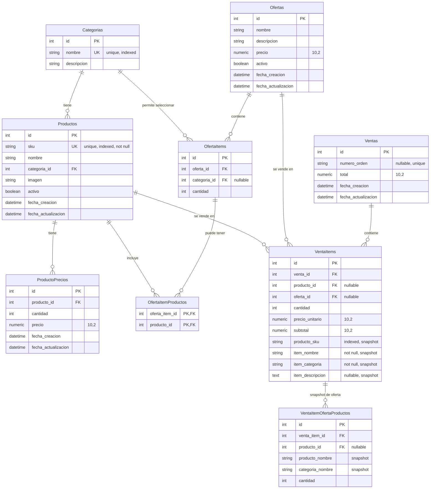

# Diagrama de Base de Datos - PizzaFiori

## Descripción General

La base de datos de PizzaFiori está diseñada para gestionar productos, categorías, precios, ofertas y ventas de una pizzería. Utiliza SQL Server (MSSQL) como motor de base de datos y SQLAlchemy como ORM.

**Características clave:**
- ✅ Gestión de productos con SKU único
- ✅ Precios escalonados por cantidad
- ✅ Sistema de ofertas flexible
- ✅ **Snapshots de ventas** para preservar información histórica
- ✅ Auditoría completa con timestamps

## Diagrama Entidad-Relación



## Descripción de Entidades

### 1. Categorias

**Tabla:** `Categorias`

**Descripción:** Representa las categorías de productos (ej: Pizzas, Bebidas, Postres, etc.)

**Campos:**

| Campo | Tipo | Restricciones | Descripción |
|-------|------|---------------|-------------|
| `id` | INTEGER | PRIMARY KEY | Identificador único de la categoría |
| `nombre` | VARCHAR(50) | NOT NULL, UNIQUE, INDEXED | Nombre de la categoría (único) |
| `descripcion` | VARCHAR(255) | NULLABLE | Descripción opcional de la categoría |

**Relaciones:**
- **Uno a Muchos** con `Productos`: Una categoría puede tener múltiples productos

**Ejemplo de datos:**
```
id | nombre    | descripcion
---|-----------|------------
1  | Pizzas    | Pizzas de todos los gustos
2  | Bebidas   | Bebidas frías y calientes
3  | Postres   | Postres caseros
```

### 2. Productos

**Tabla:** `Productos`

**Descripción:** Representa los productos disponibles en la pizzería (pizzas, bebidas, postres, etc.)

**Campos:**

| Campo | Tipo | Restricciones | Descripción |
|-------|------|---------------|-------------|
| `id` | INTEGER | PRIMARY KEY, AUTO_INCREMENT | Identificador único del producto |
| `sku` | VARCHAR(50) | NOT NULL, UNIQUE, INDEXED | Código SKU único del producto (generado automáticamente) |
| `nombre` | VARCHAR(255) | NOT NULL | Nombre del producto |
| `categoria_id` | INTEGER | FOREIGN KEY, NULLABLE | ID de la categoría a la que pertenece |
| `imagen` | VARCHAR(255) | NULLABLE | Ruta de la imagen del producto |
| `activo` | BOOLEAN | NOT NULL, DEFAULT TRUE | Indica si el producto está activo/disponible |
| `fecha_creacion` | DATETIME | DEFAULT NOW() | Fecha de creación del registro |
| `fecha_actualizacion` | DATETIME | DEFAULT NOW() | Fecha de última actualización |

**Relaciones:**
- **Muchos a Uno** con `Categorias`: Un producto pertenece a una categoría (opcional)
- **Uno a Muchos** con `ProductoPrecios`: Un producto puede tener múltiples precios
- **Uno a Muchos** con `OfertaItems`: Un producto puede estar en múltiples ofertas
- **Uno a Muchos** con `VentaItems`: Un producto puede venderse múltiples veces

**Índices:**
- `ix_Productos_id`: Índice en el campo `id`
- `ix_Productos_sku`: Índice único en el campo `sku`

**Ejemplo de datos:**
```
id | sku            | nombre          | categoria_id | imagen                    | activo | fecha_creacion
---|----------------|-----------------|--------------|---------------------------|--------|---------------
1  | PIZZ-MUZZ-001  | Muzzarella      | 1            | productos/muzzarella.jpg   | true   | 2026-01-19
2  | BEBI-COCA-001  | Coca Cola 1.5L  | 2            | productos/coca_cola.jpg   | true   | 2026-01-19
3  | POST-TIRA-001  | Tiramisú        | 3            | productos/tiramisu.jpg    | true   | 2026-01-19
```

**Nota sobre SKU:** El SKU se genera automáticamente al crear el producto usando la función `generar_sku_producto()` que combina categoría, nombre y un identificador único.

### 3. ProductoPrecios

**Tabla:** `ProductoPrecios`

**Descripción:** Almacena los precios escalonados de cada producto según la cantidad (ej: precio por unidad, precio por docena)

**Campos:**

| Campo | Tipo | Restricciones | Descripción |
|-------|------|---------------|-------------|
| `id` | INTEGER | PRIMARY KEY, AUTO_INCREMENT | Identificador único del precio |
| `producto_id` | INTEGER | FOREIGN KEY, NOT NULL | ID del producto al que pertenece el precio |
| `cantidad` | INTEGER | NOT NULL | Cantidad de unidades para este precio |
| `precio` | NUMERIC(10,2) | NOT NULL | Precio para la cantidad especificada |
| `fecha_creacion` | DATETIME | DEFAULT NOW() | Fecha de creación del registro |
| `fecha_actualizacion` | DATETIME | DEFAULT NOW() | Fecha de última actualización |

**Relaciones:**
- **Muchos a Uno** con `Productos`: Un precio pertenece a un producto

**Índices:**
- `ix_ProductoPrecios_id`: Índice en el campo `id`

**Ejemplo de datos:**
```
id | producto_id | cantidad | precio  | fecha_creacion
---|-------------|----------|---------|---------------
1  | 1           | 1        | 1200.00 | 2026-01-19
2  | 1           | 2        | 2200.00 | 2026-01-19
3  | 2           | 1        | 800.00  | 2026-01-19
```

**Nota:** Un producto puede tener múltiples precios según la cantidad. Por ejemplo, una pizza puede costar $1200 por unidad o $2200 por dos unidades.

### 4. Ofertas

**Tabla:** `Ofertas`

**Descripción:** Representa ofertas o combos que incluyen múltiples productos a un precio especial

**Campos:**

| Campo | Tipo | Restricciones | Descripción |
|-------|------|---------------|-------------|
| `id` | INTEGER | PRIMARY KEY, AUTO_INCREMENT | Identificador único de la oferta |
| `nombre` | VARCHAR(255) | NOT NULL | Nombre de la oferta |
| `descripcion` | TEXT | NULLABLE | Descripción detallada de la oferta |
| `precio` | NUMERIC(10,2) | NOT NULL | Precio total de la oferta |
| `activo` | BOOLEAN | NOT NULL, DEFAULT TRUE | Indica si la oferta está activa/disponible |
| `fecha_creacion` | DATETIME | DEFAULT NOW() | Fecha de creación del registro |
| `fecha_actualizacion` | DATETIME | DEFAULT NOW() | Fecha de última actualización |

**Relaciones:**
- **Uno a Muchos** con `OfertaItems`: Una oferta contiene múltiples items

**Índices:**
- `ix_Ofertas_id`: Índice en el campo `id`

**Ejemplo de datos:**
```
id | nombre              | descripcion                    | precio  | activo | fecha_creacion
---|---------------------|--------------------------------|---------|--------|---------------
1  | Combo Familiar      | 2 Pizzas + 2 Bebidas           | 3500.00 | true   | 2026-01-19
2  | Pizza + Bebida      | 1 Pizza Muzzarella + 1 Bebida | 1800.00 | true   | 2026-01-19
```

### 5. OfertaItems

**Tabla:** `OfertaItems`

**Descripción:** Representa un item dentro de una oferta. Puede ser:
- **Uno o varios productos específicos** (a través de la tabla `OfertaItemProductos`)
- **Una categoría** para que el cliente elija cualquier producto de esa categoría

**Campos:**

| Campo | Tipo | Restricciones | Descripción |
|-------|------|---------------|-------------|
| `id` | INTEGER | PRIMARY KEY, AUTO_INCREMENT | Identificador único del item |
| `oferta_id` | INTEGER | FOREIGN KEY, NOT NULL | ID de la oferta |
| `categoria_id` | INTEGER | FOREIGN KEY, NULLABLE | ID de la categoría (si el cliente puede elegir de una categoría) |
| `cantidad` | INTEGER | NOT NULL, DEFAULT 1 | Cantidad del producto/categoría en la oferta |

**Relaciones:**
- **Muchos a Uno** con `Ofertas`: Un item pertenece a una oferta
- **Muchos a Uno** con `Categorias`: Un item puede referenciar una categoría (opcional)
- **Uno a Muchos** con `OfertaItemProductos`: Un item puede tener múltiples productos asociados

**Índices:**
- `ix_OfertaItems_id`: Índice en el campo `id`

**Ejemplo de datos:**
```
id | oferta_id | categoria_id | cantidad | Descripción
---|-----------|--------------|----------|-------------
1  | 1         | NULL         | 1        | 1 producto específico (ver OfertaItemProductos)
2  | 1         | 2            | 2        | 2 bebidas a elección del cliente
3  | 2         | NULL         | 1        | Opciones: Pizza Napolitana O Calabresa O Jamón (ver OfertaItemProductos)
```

### 6. OfertaItemProductos

**Tabla:** `OfertaItemProductos`

**Descripción:** Tabla intermedia (junction table) que conecta items de oferta con productos. Permite que un item tenga:
- **1 producto específico** (1 registro)
- **N productos como opciones** (N registros) - el cliente elige uno

**Campos:**

| Campo | Tipo | Restricciones | Descripción |
|-------|------|---------------|-------------|
| `oferta_item_id` | INTEGER | PRIMARY KEY, FOREIGN KEY | ID del item de oferta |
| `producto_id` | INTEGER | PRIMARY KEY, FOREIGN KEY | ID del producto |

**Relaciones:**
- **Muchos a Uno** con `OfertaItems`: Un registro pertenece a un item
- **Muchos a Uno** con `Productos`: Un registro referencia un producto

**Constraints:**
- **Primary Key Compuesta:** (`oferta_item_id`, `producto_id`)
- **Foreign Keys con CASCADE:** Si se elimina un item u oferta, se eliminan estos registros

**Ejemplo de datos:**
```
oferta_item_id | producto_id | Descripción
---------------|-------------|-------------
1              | 1           | Item 1 tiene solo Pizza Muzzarella
3              | 5           | Item 3 puede ser Pizza Napolitana
3              | 6           | Item 3 puede ser Pizza Calabresa
3              | 7           | Item 3 puede ser Pizza Jamón y Morrón
```

### 7. Ventas

**Tabla:** `Ventas`

**Descripción:** Representa las ventas o pedidos realizados. Almacena el total y fecha de cada venta.

**Campos:**

| Campo | Tipo | Restricciones | Descripción |
|-------|------|---------------|-------------|
| `id` | INTEGER | PRIMARY KEY, AUTO_INCREMENT | Identificador único de la venta |
| `numero_orden` | VARCHAR(50) | NULLABLE, UNIQUE | Número de orden opcional (generado externamente) |
| `total` | NUMERIC(10,2) | NOT NULL | Monto total de la venta |
| `fecha_creacion` | DATETIME | DEFAULT NOW() | Fecha y hora de creación de la venta |
| `fecha_actualizacion` | DATETIME | DEFAULT NOW() | Fecha de última actualización |

**Relaciones:**
- **Uno a Muchos** con `VentaItems`: Una venta contiene múltiples items

**Índices:**
- `ix_Ventas_id`: Índice en el campo `id`

**Ejemplo de datos:**
```
id | numero_orden | total    | fecha_creacion      | fecha_actualizacion
---|--------------|----------|---------------------|--------------------
1  | ORD-001      | 12000.00 | 2026-02-03 10:30:00 | 2026-02-03 10:30:00
2  | NULL         | 6000.00  | 2026-02-03 11:15:00 | 2026-02-03 11:15:00
```

### 8. VentaItems

**Tabla:** `VentaItems`

**Descripción:** Representa los items individuales de una venta. **Implementa sistema de snapshots** para preservar información histórica del producto/oferta al momento de la venta.

**Campos:**

| Campo | Tipo | Restricciones | Descripción |
|-------|------|---------------|-------------|
| `id` | INTEGER | PRIMARY KEY, AUTO_INCREMENT | Identificador único del item |
| `venta_id` | INTEGER | FOREIGN KEY, NOT NULL | ID de la venta a la que pertenece |
| `producto_id` | INTEGER | FOREIGN KEY, NULLABLE | ID del producto vendido (XOR con oferta_id) |
| `oferta_id` | INTEGER | FOREIGN KEY, NULLABLE | ID de la oferta vendida (XOR con producto_id) |
| `cantidad` | INTEGER | NOT NULL | Cantidad vendida |
| `precio_unitario` | NUMERIC(10,2) | NOT NULL | Precio unitario al momento de la venta |
| `subtotal` | NUMERIC(10,2) | NOT NULL | Subtotal del item (cantidad × precio_unitario) |
| `producto_sku` | VARCHAR(50) | NULLABLE, INDEXED | **SNAPSHOT:** SKU del producto (solo para productos) |
| `item_nombre` | VARCHAR(255) | NOT NULL | **SNAPSHOT:** Nombre del producto/oferta al momento de venta |
| `item_categoria` | VARCHAR(100) | NOT NULL | **SNAPSHOT:** Categoría al momento de venta |
| `item_descripcion` | TEXT | NULLABLE | **SNAPSHOT:** Descripción de la oferta (solo para ofertas) |

**Relaciones:**
- **Muchos a Uno** con `Ventas`: Un item pertenece a una venta
- **Muchos a Uno** con `Productos`: Un item puede referenciar un producto (nullable)
- **Muchos a Uno** con `Ofertas`: Un item puede referenciar una oferta (nullable)
- **Uno a Muchos** con `VentaItemOfertaProductos`: Un item de oferta tiene snapshot de productos

**Constraints:**
- **CHECK Constraint:** `(producto_id IS NOT NULL AND oferta_id IS NULL) OR (producto_id IS NULL AND oferta_id IS NOT NULL)`
  - Garantiza que solo uno de los dos IDs esté presente (XOR)

**Índices:**
- `ix_VentaItems_id`: Índice en el campo `id`
- `ix_VentaItems_producto_sku`: Índice en el campo `producto_sku` para reportes

**Ejemplo de datos:**
```
id | venta_id | producto_id | oferta_id | cantidad | precio_unitario | subtotal | producto_sku  | item_nombre      | item_categoria | item_descripcion
---|----------|-------------|-----------|----------|-----------------|----------|---------------|------------------|----------------|------------------
1  | 1        | 1           | NULL      | 6        | 1000.00         | 6000.00  | PIZZ-MUZZ-001 | Muzzarella       | Pizzas         | NULL
2  | 1        | NULL        | 1         | 1        | 6000.00         | 6000.00  | NULL          | Combo Familiar   | Ofertas        | 2 Pizzas + 2 Bebidas
3  | 2        | 2           | NULL      | 1        | 800.00          | 800.00   | BEBI-COCA-001 | Coca Cola 1.5L   | Bebidas        | NULL
```

**Nota sobre Snapshots:** Los campos `producto_sku`, `item_nombre`, `item_categoria` e `item_descripcion` preservan la información **tal como estaba al momento de la venta**. Esto permite:
- ✅ Generar reportes históricos precisos
- ✅ Ver qué se vendió exactamente, incluso si el producto se renombra después
- ✅ Mantener integridad referencial sin perder datos si se elimina un producto

### 9. VentaItemOfertaProductos

**Tabla:** `VentaItemOfertaProductos`

**Descripción:** **Snapshot de productos incluidos en una oferta** al momento de la venta. Preserva qué productos componían una oferta cuando se realizó la venta.

**Campos:**

| Campo | Tipo | Restricciones | Descripción |
|-------|------|---------------|-------------|
| `id` | INTEGER | PRIMARY KEY, AUTO_INCREMENT | Identificador único del registro |
| `venta_item_id` | INTEGER | FOREIGN KEY, NOT NULL | ID del item de venta al que pertenece |
| `producto_id` | INTEGER | FOREIGN KEY, NULLABLE | ID del producto (puede ser NULL si se elimina) |
| `producto_nombre` | VARCHAR(255) | NOT NULL | **SNAPSHOT:** Nombre del producto al momento de venta |
| `categoria_nombre` | VARCHAR(255) | NULLABLE | **SNAPSHOT:** Categoría del producto al momento de venta |
| `cantidad` | INTEGER | NOT NULL | Cantidad de este producto en la oferta |

**Relaciones:**
- **Muchos a Uno** con `VentaItems`: Un snapshot pertenece a un item de venta
- **Muchos a Uno** con `Productos`: Referencia opcional al producto (puede ser NULL)

**Constraints:**
- **Foreign Key CASCADE:** Si se elimina un item de venta, se eliminan sus snapshots

**Índices:**
- `ix_VentaItemOfertaProductos_id`: Índice en el campo `id`

**Ejemplo de datos:**
```
id | venta_item_id | producto_id | producto_nombre    | categoria_nombre | cantidad
---|---------------|-------------|--------------------|------------------|----------
1  | 2             | 1           | Muzzarella         | Pizzas           | 1
2  | 2             | 5           | Napolitana         | Pizzas           | 1
3  | 2             | 2           | Coca Cola 1.5L     | Bebidas          | 2
```

**Nota:** Este snapshot permite saber exactamente qué productos contenía una oferta al momento de la venta, incluso si la oferta cambia después o se eliminan productos.

## Relaciones Detalladas

### Relación Categorias → Productos

- **Tipo:** Uno a Muchos (1:N)
- **Cardinalidad:** Una categoría puede tener cero o muchos productos
- **Foreign Key:** `Productos.categoria_id` → `Categorias.id`
- **Comportamiento:** Si se elimina una categoría, los productos asociados mantienen `categoria_id = NULL` (no se eliminan)

### Relación Productos → ProductoPrecios

- **Tipo:** Uno a Muchos (1:N)
- **Cardinalidad:** Un producto puede tener uno o muchos precios
- **Foreign Key:** `ProductoPrecios.producto_id` → `Productos.id`
- **Comportamiento:** Si se elimina un producto, se eliminan sus precios (CASCADE)

### Relación Ofertas → OfertaItems

- **Tipo:** Uno a Muchos (1:N)
- **Cardinalidad:** Una oferta puede tener uno o muchos items
- **Foreign Key:** `OfertaItems.oferta_id` → `Ofertas.id`
- **Comportamiento:** Si se elimina una oferta, se eliminan sus items (CASCADE)

### Relación Categorias → OfertaItems

- **Tipo:** Uno a Muchos (1:N)
- **Cardinalidad:** Una categoría puede estar en cero o muchos items de oferta
- **Foreign Key:** `OfertaItems.categoria_id` → `Categorias.id`
- **Comportamiento:** Si se elimina una categoría, los items mantienen `categoria_id = NULL`

### Relación OfertaItems → OfertaItemProductos

- **Tipo:** Uno a Muchos (1:N)
- **Cardinalidad:** Un item puede tener uno o muchos productos asociados
- **Foreign Key:** `OfertaItemProductos.oferta_item_id` → `OfertaItems.id`
- **Comportamiento:** Si se elimina un item, se eliminan sus productos asociados (CASCADE)

### Relación Productos → OfertaItemProductos

- **Tipo:** Uno a Muchos (1:N)
- **Cardinalidad:** Un producto puede estar en cero o muchos items de oferta
- **Foreign Key:** `OfertaItemProductos.producto_id` → `Productos.id`
- **Comportamiento:** Si se elimina un producto, se eliminan las asociaciones (CASCADE)

### Relación Ventas → VentaItems

- **Tipo:** Uno a Muchos (1:N)
- **Cardinalidad:** Una venta contiene uno o muchos items
- **Foreign Key:** `VentaItems.venta_id` → `Ventas.id`
- **Comportamiento:** Si se elimina una venta, se eliminan sus items (CASCADE)

### Relación Productos → VentaItems

- **Tipo:** Uno a Muchos (1:N)
- **Cardinalidad:** Un producto puede venderse en cero o muchos items de venta
- **Foreign Key:** `VentaItems.producto_id` → `Productos.id`
- **Comportamiento:** **NULL** - Si se elimina un producto, las ventas mantienen `producto_id = NULL` pero conservan los datos snapshot
- **Nota:** La relación es opcional porque los datos históricos se preservan en campos snapshot

### Relación Ofertas → VentaItems

- **Tipo:** Uno a Muchos (1:N)
- **Cardinalidad:** Una oferta puede venderse en cero o muchos items de venta
- **Foreign Key:** `VentaItems.oferta_id` → `Ofertas.id`
- **Comportamiento:** **NULL** - Si se elimina una oferta, las ventas mantienen `oferta_id = NULL` pero conservan los datos snapshot
- **Nota:** La relación es opcional porque los datos históricos se preservan en campos snapshot y tabla de snapshot

### Relación VentaItems → VentaItemOfertaProductos

- **Tipo:** Uno a Muchos (1:N)
- **Cardinalidad:** Un item de venta (oferta) puede tener cero o muchos productos en su snapshot
- **Foreign Key:** `VentaItemOfertaProductos.venta_item_id` → `VentaItems.id`
- **Comportamiento:** Si se elimina un item de venta, se eliminan sus snapshots de productos (CASCADE)

### Relación Productos → VentaItemOfertaProductos

- **Tipo:** Uno a Muchos (1:N)
- **Cardinalidad:** Un producto puede estar en cero o muchos snapshots de ofertas vendidas
- **Foreign Key:** `VentaItemOfertaProductos.producto_id` → `Productos.id`
- **Comportamiento:** **NULL** - Si se elimina un producto, los snapshots mantienen `producto_id = NULL` pero conservan el nombre del producto

## Constraints y Validaciones

### Constraints de Base de Datos

1. **Primary Keys:** Todas las tablas tienen un campo `id` como clave primaria
2. **Foreign Keys:** Todas las relaciones están definidas con foreign keys
3. **Unique Constraints:** 
   - `Categorias.nombre` es único
   - `Productos.sku` es único
   - `Ventas.numero_orden` es único (cuando no es NULL)
4. **CHECK Constraints:**
   - `VentaItems`: XOR entre `producto_id` y `oferta_id` (solo uno puede estar presente)
5. **NOT NULL:** Campos críticos como `nombre`, `precio`, `activo`, `sku` son obligatorios
6. **Default Values:** 
   - `activo` tiene valor por defecto `TRUE`
   - `fecha_creacion` y `fecha_actualizacion` tienen valor por defecto `NOW()`
   - `cantidad` en `OfertaItems` tiene valor por defecto `1`

### Validaciones de Negocio (a nivel de aplicación)

1. **Productos:**
   - El nombre no puede estar vacío
   - El SKU se genera automáticamente al crear el producto
   - La imagen debe ser una ruta válida si se proporciona
   - Debe tener al menos un precio asociado
   - La categoría debe existir si se proporciona

2. **ProductoPrecios:**
   - La cantidad debe ser mayor a 0
   - El precio debe ser mayor a 0
   - No puede haber precios duplicados para la misma cantidad del mismo producto

3. **Ofertas:**
   - El precio debe ser mayor a 0
   - Debe tener al menos un producto asociado

4. **OfertaItems:**
   - La cantidad debe ser mayor a 0
   - Debe tener productos asociados (via `OfertaItemProductos`) O una categoría, pero no ambos
   - Si tiene productos, deben existir y estar activos
   - Si tiene `producto_opciones` (múltiples productos), debe tener al menos 2 productos
   - Si tiene categoría, la categoría debe existir

5. **Ventas:**
   - Debe tener al menos un item
   - El total debe ser mayor a 0
   - Cada item debe tener producto_id XOR oferta_id (no ambos, no ninguno)
   - Los snapshots se capturan automáticamente al crear la venta

## Índices y Optimizaciones

### Índices Existentes

1. **Categorias:**
   - `ix_Categorias_nombre`: Índice único en `nombre` para búsquedas rápidas

2. **Productos:**
   - `ix_Productos_id`: Índice en `id` (automático por PRIMARY KEY)
   - `ix_Productos_sku`: Índice único en `sku` para búsquedas y unicidad
   - Índice implícito en `categoria_id` (FOREIGN KEY)

3. **ProductoPrecios:**
   - `ix_ProductoPrecios_id`: Índice en `id`
   - Índice implícito en `producto_id` (FOREIGN KEY)

4. **Ofertas:**
   - `ix_Ofertas_id`: Índice en `id`

5. **OfertaItems:**
   - `ix_OfertaItems_id`: Índice en `id`
   - Índices implícitos en `oferta_id` y `categoria_id` (FOREIGN KEYS)

6. **Ventas:**
   - `ix_Ventas_id`: Índice en `id`

7. **VentaItems:**
   - `ix_VentaItems_id`: Índice en `id`
   - `ix_VentaItems_producto_sku`: Índice en `producto_sku` para reportes
   - Índices implícitos en `venta_id`, `producto_id`, `oferta_id` (FOREIGN KEYS)

8. **VentaItemOfertaProductos:**
   - `ix_VentaItemOfertaProductos_id`: Índice en `id`
   - Índices implícitos en `venta_item_id`, `producto_id` (FOREIGN KEYS)

### Optimizaciones Recomendadas

1. **Índice compuesto en Productos:**
   ```sql
   CREATE INDEX idx_productos_categoria_activo 
   ON Productos(categoria_id, activo);
   ```
   Útil para consultas que filtran por categoría y estado activo.

2. **Índice en ProductoPrecios:**
   ```sql
   CREATE INDEX idx_precios_producto_cantidad 
   ON ProductoPrecios(producto_id, cantidad);
   ```
   Útil para buscar precios de un producto por cantidad.

3. **Índice en Ofertas:**
   ```sql
   CREATE INDEX idx_ofertas_activo 
   ON Ofertas(activo);
   ```
   Útil para filtrar ofertas activas.

4. **Índice compuesto en VentaItems para reportes:**
   ```sql
   CREATE INDEX idx_ventaitems_fecha_categoria
   ON VentaItems(fecha_creacion, item_categoria);
   ```
   Útil para reportes de ventas por período y categoría.

5. **Índice en VentaItems para búsqueda por nombre:**
   ```sql
   CREATE INDEX idx_ventaitems_nombre
   ON VentaItems(item_nombre);
   ```
   Útil para búsquedas de productos vendidos por nombre.

## Snapshots y Preservación de Datos Históricos

### ¿Por qué Snapshots?

El sistema implementa **snapshots** en las ventas para preservar la información histórica exacta al momento de cada transacción. Esto resuelve problemas comunes en sistemas de ventas:

**Problemas sin snapshots:**
- ❌ Si renombras "Muzarella" a "Muzzarella", los reportes históricos muestran el nuevo nombre
- ❌ Si eliminas un producto, pierdes el historial de qué se vendió
- ❌ Si cambias una oferta, no sabes qué incluía cuando se vendió
- ❌ Reportes inexactos por cambios en categorías o descripciones

**Solución con snapshots:**
- ✅ Los reportes muestran exactamente cómo estaba nombrado el producto al venderlo
- ✅ El historial se mantiene incluso si eliminas productos/ofertas
- ✅ Sabes exactamente qué contenía cada oferta vendida
- ✅ Reportes precisos e inmutables

### Campos Snapshot

#### En VentaItems:
- `producto_sku`: SKU del producto (inmutable para reportes)
- `item_nombre`: Nombre exacto al momento de venta
- `item_categoria`: Categoría al momento de venta  
- `item_descripcion`: Descripción de oferta (si aplica)

#### En VentaItemOfertaProductos:
- `producto_nombre`: Nombre del producto en la oferta
- `categoria_nombre`: Categoría del producto
- `cantidad`: Cantidad incluida en la oferta

### Ejemplo de Uso

```python
# Al crear una venta, se capturan automáticamente los snapshots:
venta_item = SaleItem(
    venta_id=1,
    producto_id=5,
    cantidad=6,
    precio_unitario=1000.00,
    subtotal=6000.00,
    # SNAPSHOTS capturados automáticamente:
    producto_sku=producto.sku,           # "PIZZ-MUZZ-001"
    item_nombre=producto.nombre,          # "Muzzarella"
    item_categoria=producto.categoria.nombre,  # "Pizzas"
    item_descripcion=None
)
```

**Ventajas:**
- 📊 Reportes confiables a través del tiempo
- 🔍 Auditoría completa de qué se vendió
- 🛡️ Protección contra cambios accidentales
- 📈 Análisis histórico preciso

## Migraciones

Las migraciones de base de datos se gestionan mediante **Alembic**. El esquema inicial se encuentra en:

`backend/alembic/versions/48cef8795b61_initial_schema.py`

### Comandos de Migración

```bash
# Crear una nueva migración
cd backend
alembic revision --autogenerate -m "descripción del cambio"

# Aplicar migraciones pendientes
alembic upgrade head

# Revertir última migración
alembic downgrade -1
```

## Modelo de Datos en SQLAlchemy

Los modelos están definidos en `backend/app/domain/models/`:

- `category.py` → Tabla `Categorias`
- `product.py` → Tabla `Productos`
- `product_price.py` → Tabla `ProductoPrecios`
- `offer.py` → Tabla `Ofertas`
- `offer_item.py` → Tabla `OfertaItems` y tabla intermedia `oferta_item_productos`
- `sale.py` → Tabla `Ventas`
- `sale_item.py` → Tabla `VentaItems`
- `sale_item_offer_product.py` → Tabla `VentaItemOfertaProductos`

Cada modelo extiende de `Base` (SQLAlchemy) y define las relaciones usando `relationship()`.

## Consideraciones de Diseño

### Ventajas del Diseño Actual

✅ **SKU único:** Cada producto tiene un identificador inmutable para reportes  
✅ **Flexibilidad de precios:** Permite precios escalonados por cantidad  
✅ **Ofertas configurables:** Las ofertas pueden incluir cualquier combinación de productos  
✅ **Soft delete:** El campo `activo` permite desactivar sin eliminar  
✅ **Auditoría:** Campos `fecha_creacion` y `fecha_actualizacion` para trazabilidad  
✅ **Normalización:** Diseño normalizado que evita redundancia  
✅ **Snapshots de ventas:** Preserva información histórica exacta e inmutable  
✅ **Integridad referencial flexible:** Foreign keys opcionales con datos preservados en snapshots

### Sistema de Snapshots

El diseño implementa un **patrón de snapshot híbrido**:

1. **Referencia opcional:** `producto_id` y `oferta_id` pueden ser NULL
2. **Datos inmutables:** Los campos snapshot (`item_nombre`, `producto_sku`, etc.) son NOT NULL
3. **Snapshot relacional:** `VentaItemOfertaProductos` preserva la composición de ofertas

Este enfoque combina:
- **Integridad referencial** cuando los datos existen
- **Preservación histórica** cuando se eliminan
- **Reportes precisos** basados en snapshots, no en referencias

### Posibles Mejoras Futuras

- Agregar tabla de **Clientes** para tracking de ventas por cliente
- Agregar tabla de **Usuarios** si se implementa autenticación
- Agregar tabla de **Inventario** para control de stock
- Agregar campo `orden` en `OfertaItems` para definir el orden de visualización
- Agregar campo `descuento_porcentaje` en `Ofertas` como alternativa al precio fijo
- Agregar índices full-text en `item_nombre` para búsquedas avanzadas
- Implementar particionamiento de tabla `Ventas` por fecha para mejorar performance en reportes históricos

---

**Última actualización:** Febrero 2026  
**Versión del esquema:** 2.0 (con snapshots de ventas)
