# Manual de Usuario — Pizza Fiori
**Sistema de Gestión Interno**
Versión 1.0 · Marzo 2026

---

## Cómo leer este manual

| Símbolo | Significado |
|--------|-------------|
| **Texto en negrita** | Nombre de un botón, campo o menú en la pantalla |
| 💡 **Consejo** | Un tip útil para usar mejor el sistema |
| ⚠️ **Atención** | Algo importante que no debés pasarte por alto |
| 🔐 **Solo Administrador** | Esta sección solo la ven los usuarios con rol *Administrador* |
| `📸 [IMG-XXX]` | Lugar donde va la captura de pantalla |

---

## Índice

1. [¿Qué es Pizza Fiori?](#1-qué-es-pizza-fiori)
2. [Primeros pasos: cómo entrar al sistema](#2-primeros-pasos-cómo-entrar-al-sistema)
3. [Cómo navegar por el sistema](#3-cómo-navegar-por-el-sistema)
4. [Registrar una venta](#4-registrar-una-venta)
5. [Ver el historial de ventas](#5-ver-el-historial-de-ventas)
6. [Gestión de stock](#6-gestión-de-stock)
7. [Mi perfil](#7-mi-perfil)
8. [🔐 Productos (Admin)](#8--productos-admin)
9. [🔐 Ofertas (Admin)](#9--ofertas-admin)
10. [🔐 Gastos (Admin)](#10--gastos-admin)
11. [🔐 Dashboard — Estadísticas (Admin)](#11--dashboard--estadísticas-admin)
12. [🔐 Reportes (Admin)](#12--reportes-admin)
13. [🔐 Auditoría (Admin)](#13--auditoría-admin)
14. [🔐 Gestión de Usuarios (Admin)](#14--gestión-de-usuarios-admin)
15. [Preguntas frecuentes](#15-preguntas-frecuentes)

---

## 1. ¿Qué es Pizza Fiori?

Pizza Fiori es el sistema interno que usás para manejar todo lo del negocio: registrar ventas, controlar el stock, llevar los gastos y ver cómo va el negocio día a día.

No necesitás saber nada de computación para usarlo. Cada pantalla tiene botones claros y este manual te explica paso a paso qué hacer.

### ¿Qué puedo hacer con el sistema?

**Todos los usuarios pueden:**
- Registrar ventas nuevas
- Ver el historial de ventas
- Controlar el stock de productos
- Ver y cambiar sus datos de usuario

**Solo los Administradores además pueden:**
- Crear, editar y borrar productos y ofertas
- Registrar y controlar los gastos del negocio
- Ver estadísticas y gráficos de ventas
- Generar reportes en PDF
- Ver el historial de cambios del sistema
- Crear y gestionar usuarios

---

## 2. Primeros pasos: cómo entrar al sistema

### 2.1 Abrir el sistema

1. Abrí el navegador de internet (puede ser Chrome, Edge o cualquier otro).
2. En la barra de direcciones (arriba, donde escribís la dirección de las páginas web), escribí la dirección que te dio el administrador.
3. Presioná **Enter** en el teclado.

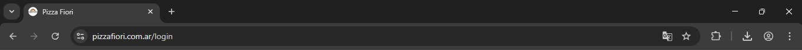

### 2.2 Iniciar sesión

Una vez que el sistema cargó, vas a ver la pantalla de inicio de sesión con el logo de Pizza Fiori.

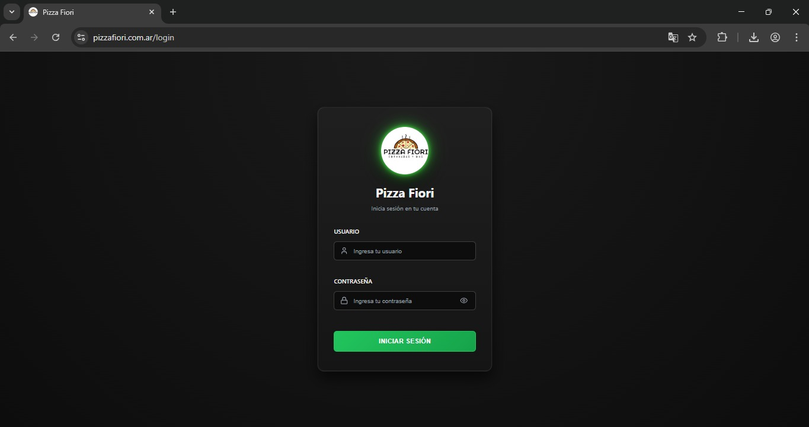

Para entrar:

1. En el campo **Usuario**, escribí tu nombre de usuario (te lo dio el administrador cuando te creó la cuenta).
2. En el campo **Contraseña**, escribí tu contraseña.
   - Si querés ver lo que estás escribiendo, hacé clic en el ícono del ojo 👁️ que aparece a la derecha del campo.
3. Hacé clic en el botón **Iniciar sesión**.

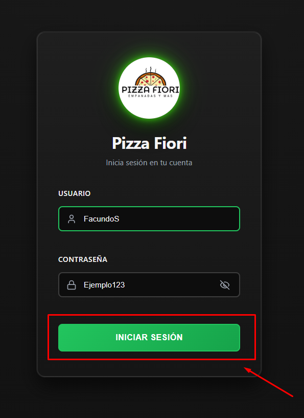

💡 **Consejo:** Si pusiste mal el usuario o la contraseña, el sistema te va a mostrar un mensaje de error en rojo. Revisá bien que no haya espacios de más ni mayúsculas donde no van.

⚠️ **Atención:** Si intentás entrar muchas veces seguidas con la contraseña incorrecta, el sistema puede bloquear tu cuenta por seguridad. Si eso pasa, avisale al administrador para que la desbloquee.

### 2.3 ¿Olvidé mi contraseña?

El sistema no tiene un botón de "olvidé mi contraseña". Si no podés entrar, avisale al administrador para que te ayude.

### 2.4 Cerrar sesión

Para salir del sistema de forma segura:

1. En el menú de la izquierda, bajá hasta el final.
2. Hacé clic en el ícono de salida 🚪 (se llama **Cerrar sesión**).

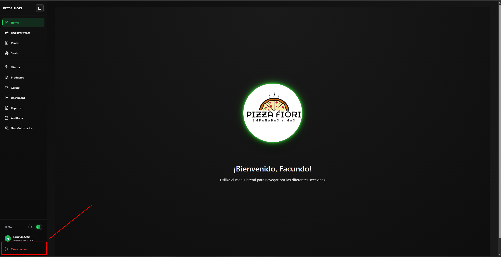

⚠️ **Atención:** Siempre cerrá sesión antes de alejarte de la computadora, especialmente si la usan otras personas.

---

## 3. Cómo navegar por el sistema

### 3.1 El menú lateral

Cuando entrés al sistema, vas a ver una barra de menú a la izquierda de la pantalla. Desde ahí podés ir a todas las secciones.

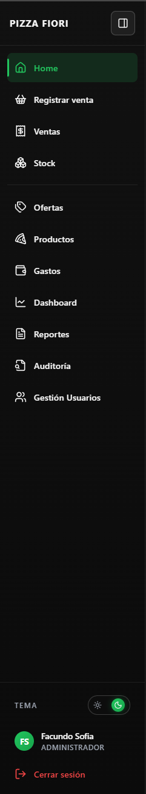

**Opciones disponibles para todos los usuarios:**

| Opción del menú | Para qué sirve |
|----------------|----------------|
| 🏠 (Inicio) | Vuelve a la pantalla de bienvenida |
| **Registrar venta** | Abre la pantalla para cargar una venta nueva |
| **Ventas** | Muestra el listado de todas las ventas registradas |
| **Stock** | Muestra el stock actual de cada producto |

**Opciones solo para Administradores (aparecen más abajo):**

| Opción del menú | Para qué sirve |
|----------------|----------------|
| **Ofertas** | Gestionar las ofertas del negocio |
| **Productos** | Gestionar el catálogo de productos |
| **Gastos** | Registrar y ver los gastos |
| **Dashboard** | Ver estadísticas y gráficos |
| **Reportes** | Generar reportes en PDF |
| **Auditoría** | Ver el historial de cambios |
| **Gestión Usuarios** | Crear y administrar usuarios |

### 3.2 Cambiar entre tema claro y oscuro

Al final del menú lateral hay un botón con un ícono de sol 🌞 o luna 🌙. Hacé clic en él para cambiar entre el fondo blanco y el fondo oscuro, según lo que te sea más cómodo.

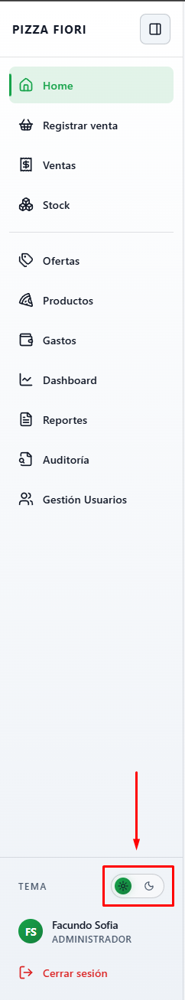

### 3.3 Ver quién está conectado

Al final del menú también podés ver el nombre y el rol (*USUARIO* o *ADMINISTRADOR*) de la persona que está conectada en ese momento.

---

## 4. Registrar una venta

Esta es la pantalla donde cargás lo que se vendió. Podés agregar productos individuales, elegir una oferta especial, o armar una pizza mitad y mitad.

Para llegar a esta pantalla, hacé clic en **Registrar venta** en el menú lateral.

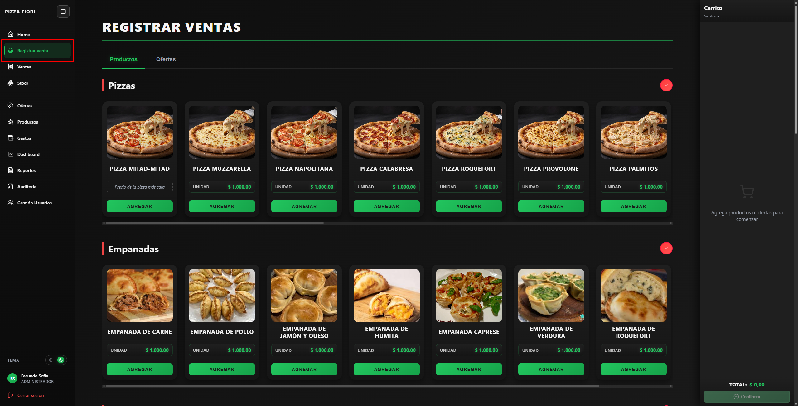

### 4.1 Agregar productos a la venta

La pantalla tiene dos pestañas: **Productos** y **Ofertas**. Si no ves las pestañas, estás en la pantalla correcta — por defecto se abre en la pestaña de Productos.

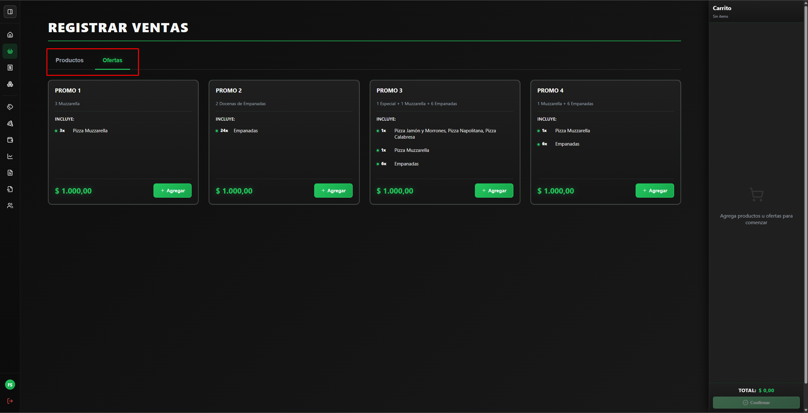

Para agregar un producto:

1. En la pestaña **Productos**, buscá el producto que querés vender.
2. Hacé clic en el producto para agregarlo a la venta.
   - Cada vez que hacés clic en el mismo producto, se suma uno más.
3. Del lado derecho (o abajo del todo si la pantalla es chica) vas a ver el **carrito** con todos los productos que fuiste agregando.

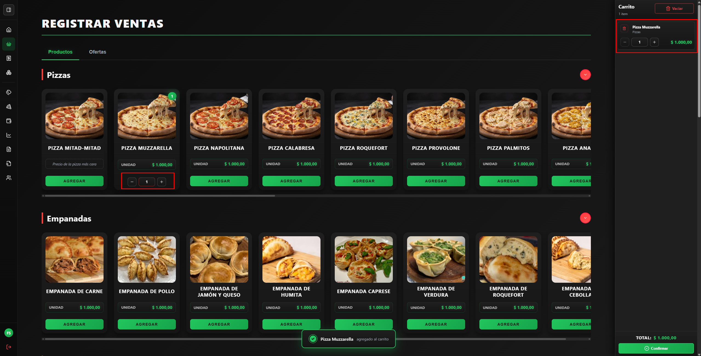

💡 **Consejo:** Si agregaste por error un producto que no era, podés quitarlo desde el carrito.

### 4.2 Agregar una oferta

Si el cliente pide una oferta especial (por ejemplo, una combo):

1. Hacé clic en la pestaña **Ofertas**.
2. Vas a ver todas las ofertas disponibles.
3. Hacé clic en la oferta que el cliente eligió.

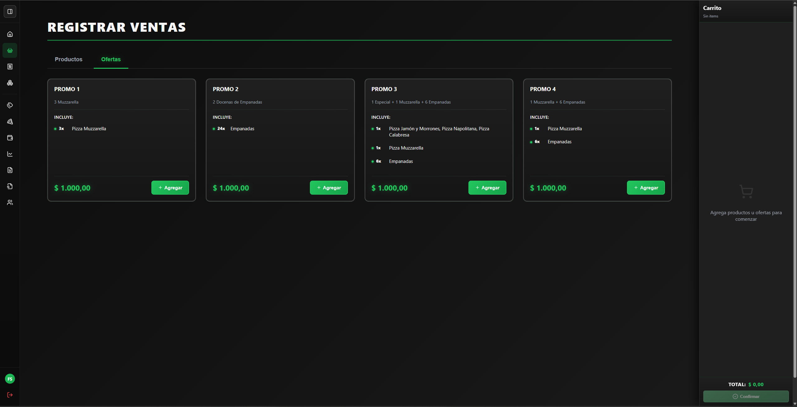

Si la oferta necesita que elijas productos dentro de la oferta (por ejemplo, elegir qué sabores van incluidos), se va a abrir una ventana para que completes esa información.

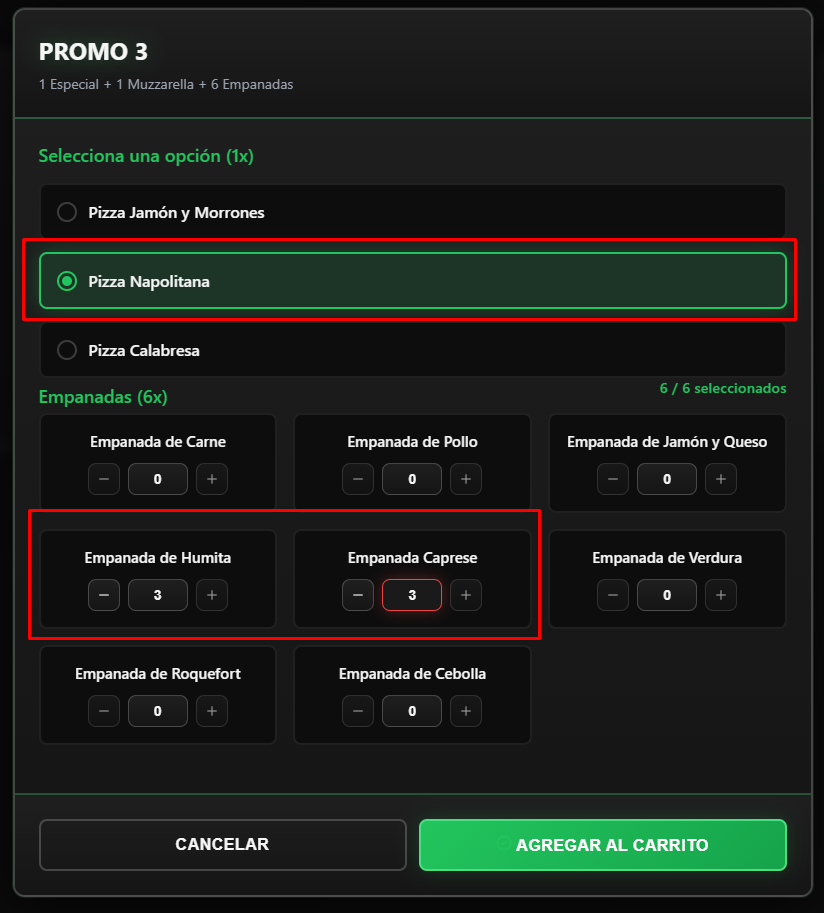

### 4.3 Armar una pizza mitad y mitad

Si el cliente quiere una pizza con dos sabores distintos:

1. Buscá el botón de **Pizza mitad y mitad** (es el botón especial que aparece en la pestaña de Productos).
2. Se va a abrir una ventana donde podés elegir un sabor para cada mitad.
3. Elegí el primer sabor y el segundo sabor.
4. Hacé clic en **Agregar al carrito** (o el botón correspondiente para confirmar).

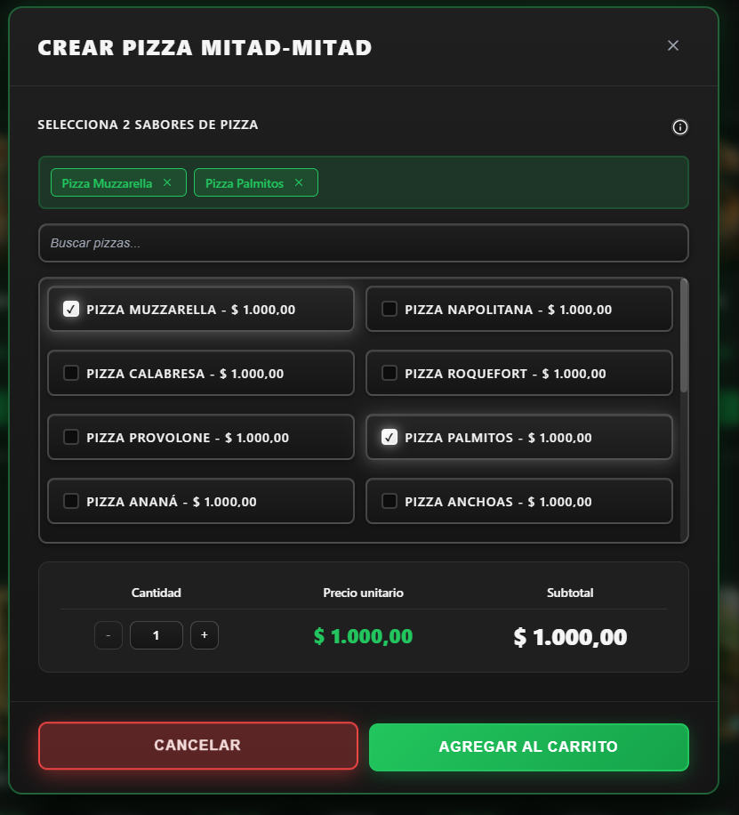

### 4.4 Revisar el carrito

El carrito es la parte de la pantalla donde ves todo lo que vas cargando a la venta.

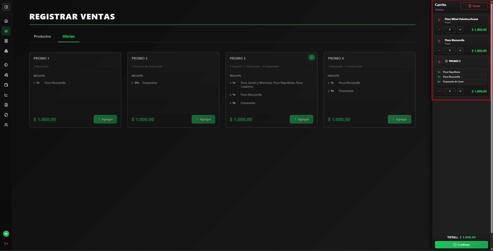

En el carrito podés:
- Ver los nombres y cantidades de cada ítem
- Ver el precio subtotal de cada ítem
- Ver el **Total** de la venta en la parte de abajo
- Hacer clic en el botón de eliminar (ícono de tacho de basura 🗑️) para quitar un ítem

### 4.5 Confirmar y finalizar la venta

Cuando tenés todos los productos en el carrito:

1. Hacé clic en el botón **Confirmar venta** (o similar, aparece abajo del carrito).
2. El sistema te va a pedir que confirmes con un mensaje de "¿Estás seguro?".
3. Hacé clic en **Confirmar** (o **Sí, confirmar**).

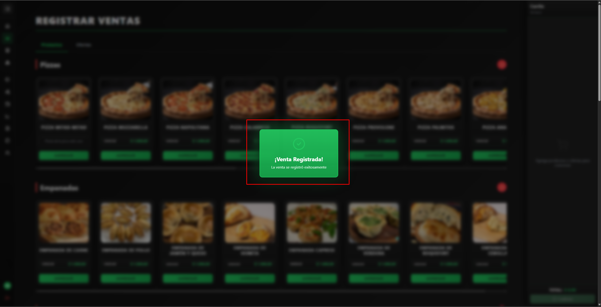

Una vez confirmada, el sistema registra la venta, actualiza el stock automáticamente y te muestra un mensaje de éxito en verde.

⚠️ **Atención:** Una vez que confirmás la venta, el stock se descuenta automaticamente. Si cometiste un error, podés ir a la sección **Ventas** para editar o eliminar esa venta.

---

## 5. Ver el historial de ventas

Esta pantalla muestra todas las ventas que se registraron, ordenadas de la más reciente a la más antigua.

Para llegar aquí, hacé clic en **Ventas** en el menú lateral.

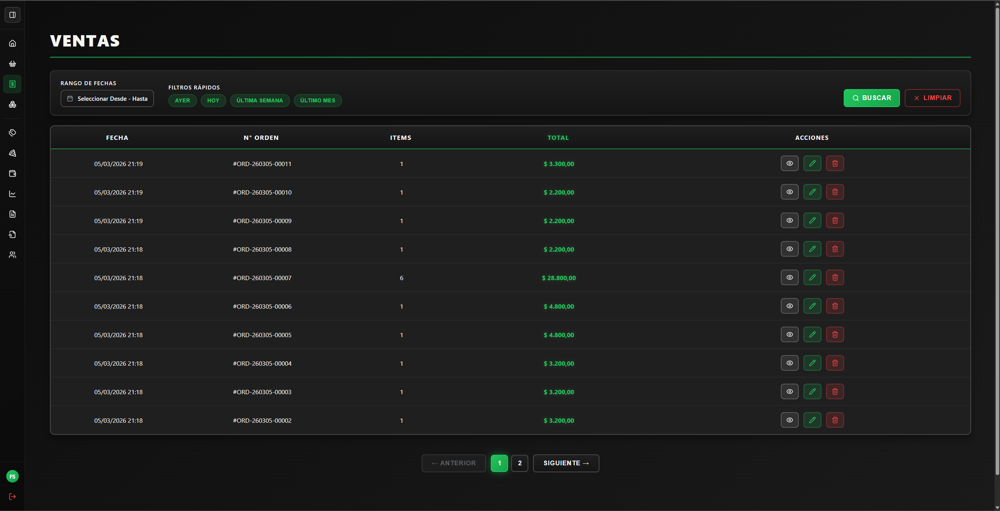

### 5.1 Cómo leer la lista de ventas

Cada fila de la tabla es una venta. Las columnas muestran:
- **Número de orden**: el código único de esa venta (por ejemplo, `ORD-20260306-001`)
- **Fecha**: cuándo se realizó la venta
- **Total**: el monto total de esa venta
- **Acciones**: botones para ver el detalle, editar o eliminar

### 5.2 Filtrar ventas por fecha

Si querés buscar las ventas de un período específico:

1. Hacé clic en el campo **Desde** y elegí la fecha de inicio.
2. Hacé clic en el campo **Hasta** y elegí la fecha de fin.
3. Hacé clic en el botón **Buscar** o **Filtrar**.

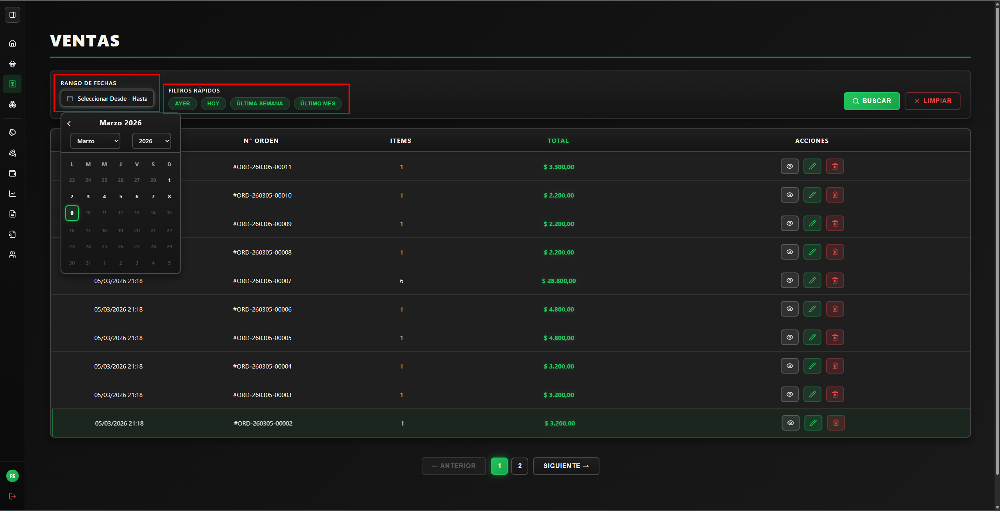

Para ver todas las ventas de vuelta, hacé clic en el botón de limpiar filtros (ícono de X o texto "Limpiar").

### 5.3 Ver el detalle de una venta

Para ver qué había en una venta:

1. Buscá la venta en la lista.
2. Hacé clic en el ícono de ojo 👁️ que aparece en la columna de **Acciones** de esa fila.
3. Se va a abrir una ventana con el detalle completo: qué productos se vendieron, las cantidades y los precios.

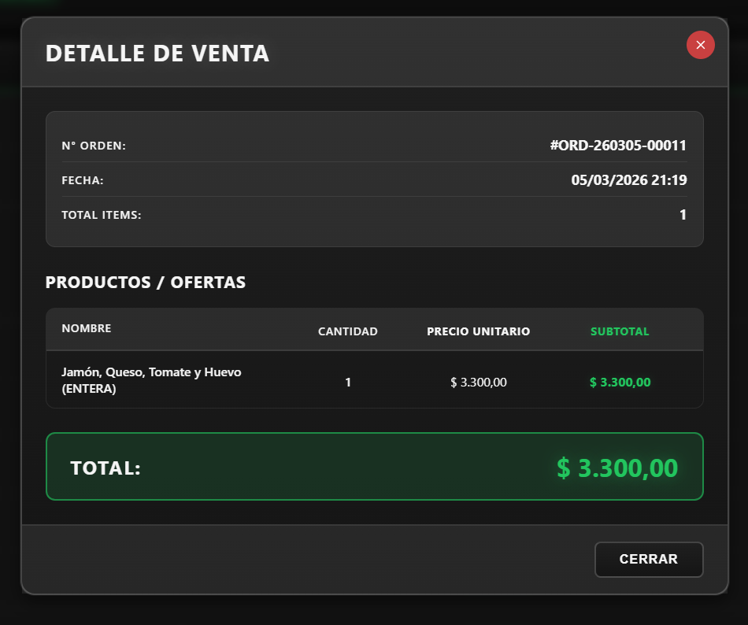

4. Para cerrar la ventana, hacé clic en la **X** de la esquina superior derecha, o hacé clic fuera de la ventana.

### 5.4 Editar una venta ya registrada

Si necesitás modificar una venta (por ejemplo, cambiar una cantidad que estaba mal):

1. Buscá la venta en la lista.
2. Hacé clic en el ícono de lápiz ✏️ que aparece en la columna de **Acciones**.
3. Se va a abrir una ventana para editar la venta.
4. Hacé los cambios que necesitás.
5. Hacé clic en **Guardar** para confirmar los cambios.

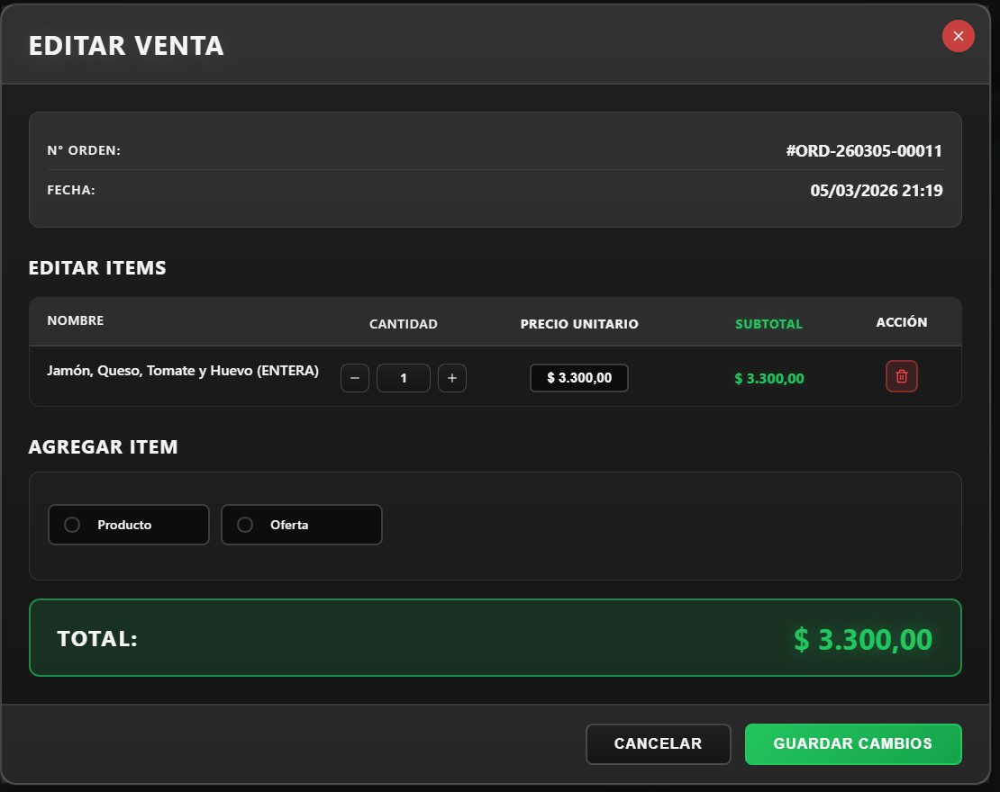

### 5.5 Eliminar una venta

⚠️ **Atención:** Eliminar una venta es una acción permanente. El stock que se había descontado vuelve a sumarse automáticamente.

1. Buscá la venta en la lista.
2. Hacé clic en el ícono de tacho de basura 🗑️ que aparece en la columna de **Acciones**.
3. El sistema te va a pedir confirmación. Leé bien el mensaje antes de confirmar.
4. Hacé clic en **Eliminar** (o **Confirmar**) solo si estás seguro/a.

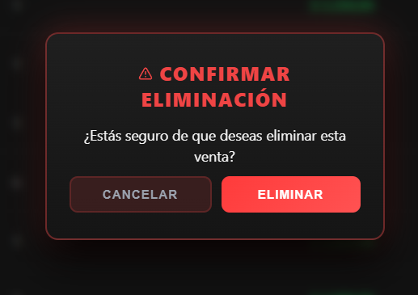

### 5.6 Navegar entre páginas

Si hay muchas ventas, el sistema las muestra de a 10 por página. Para pasar a la siguiente página:

- Hacé clic en el botón **›** (siguiente) o **‹** (anterior) que aparece abajo de la lista.
- También podés hacer clic directamente en el número de página.

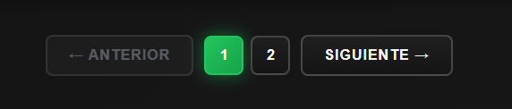

---

## 6. Gestión de stock

Esta pantalla te permite ver cuánto stock hay de cada producto y agregar más cuando hace falta.

Para llegar aquí, hacé clic en **Stock** en el menú lateral.

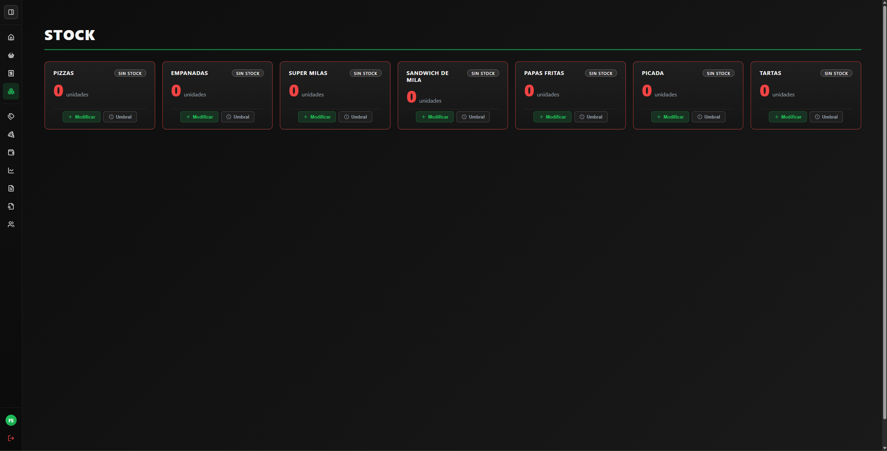

### 6.1 Cómo leer el stock

Los productos están organizados por categoría (por ejemplo, Pizzas, Empanadas, Bebidas). Para cada categoría ves:

- **El nombre del producto**
- **La cantidad disponible** (el número de unidades que hay en este momento)
- **Un indicador de color** que te dice si el stock está bien o si hay que reponer:

| Color | Qué significa |
|-------|---------------|
| 🟢 Verde | El stock está bien, no hay que preocuparse |
| 🟡 Amarillo | El stock está bajo, próximamente hay que reponer |
| 🔴 Rojo | ¡Stock crítico o sin stock! Hay que reponer urgente |

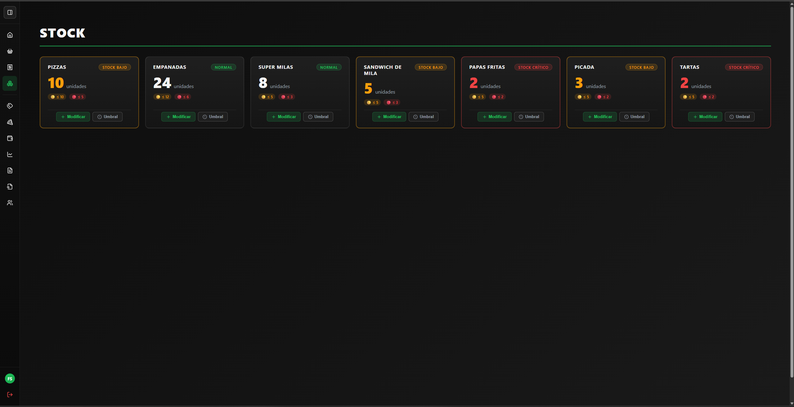

### 6.2 Agregar stock

Cuando entró mercadería o hay que sumar unidades a algún producto:

1. Buscá el producto al que querés agregar stock.
2. Hacé clic en el botón **Agregar stock** (o el ícono de + que aparece al lado del producto).
3. Se abre una ventana pequeña. Escribí la cantidad de unidades que querés agregar.
4. Hacé clic en **Guardar**.

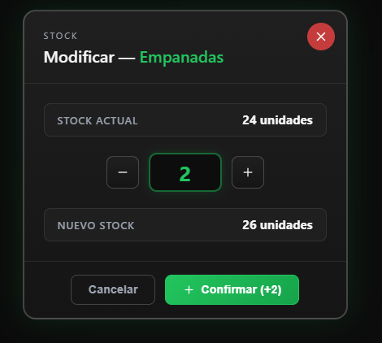

💡 **Consejo:** El número que ingresás se *suma* al stock actual. Si tenés 10 unidades y agregás 5, quedás con 15.

### 6.3 Configurar alertas de stock mínimo y máximo

Cada producto puede tener configurados los límites que determinan cuándo el indicador se pone amarillo o rojo.

> Solo los Administradores pueden configurar estas alertas.

1. Buscá el producto.
2. Hacé clic en el botón de configurar alertas (ícono de campanita 🔔 o engranaje ⚙️).
3. Se abre una ventana donde podés poner:
   - **Stock mínimo**: a partir de cuántas unidades se pone el indicador en rojo
   - **Stock máximo**: cuántas unidades se consideran "lleno"
4. Hacé clic en **Guardar**.

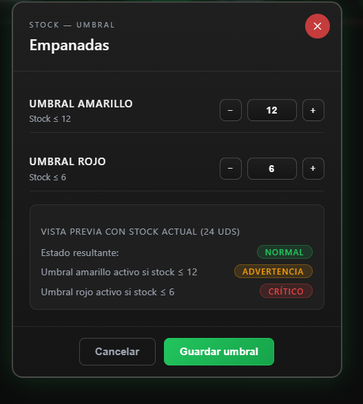

---

## 7. Mi perfil

Aquí podés ver tu información personal y cambiar tu contraseña.

Para llegar aquí, buscá tu nombre en la parte inferior del menú lateral y hacé clic en él, o buscá el ícono de persona 👤 y hacé clic.

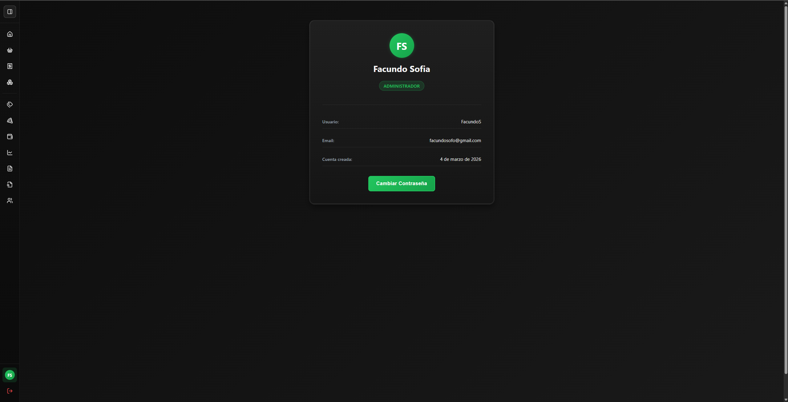

### 7.1 Ver mis datos

Vas a ver tu:
- **Nombre completo**
- **Nombre de usuario** (el que usás para entrar)
- **Email**
- **Rol** (USUARIO o ADMINISTRADOR)

No podés cambiar el nombre de usuario ni el email desde aquí. Si necesitás cambiar esos datos, avisale al administrador.

### 7.2 Cambiar mi contraseña

1. En la pantalla del perfil, buscá la sección o el botón **Cambiar contraseña**.
2. Hacé clic en ese botón para que aparezca el formulario.
3. En el campo **Contraseña actual**, escribí la contraseña que usás ahora.
4. En el campo **Nueva contraseña**, escribí la nueva contraseña que querés usar.
5. En el campo **Confirmar nueva contraseña**, escribí la nueva contraseña otra vez (para confirmar que no te equivocaste).
6. Hacé clic en **Guardar**.

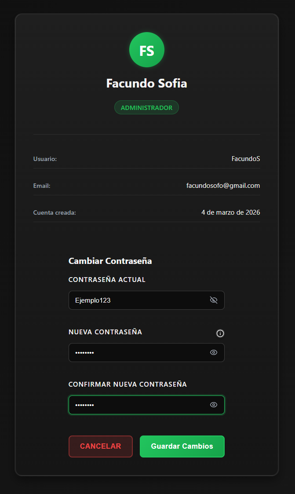

Si el cambio fue exitoso, el sistema te va a mostrar un mensaje en verde.

⚠️ **Atención:** La nueva contraseña debe ser segura. Usa una combinación de letras, números y símbolos, y que no sea fácil de adivinar (por ejemplo, evitá poner "1234" o tu nombre).

---

---

# Secciones para Administradores

> Las secciones que siguen solo son visibles y accesibles para los usuarios con rol **Administrador**. Si sos usuario normal, estas opciones no van a aparecer en tu menú.

---

## 8. 🔐 Productos (Admin)

Aquí gestionás el catálogo completo de productos del negocio.

Para llegar, hacé clic en **Productos** en el menú lateral.

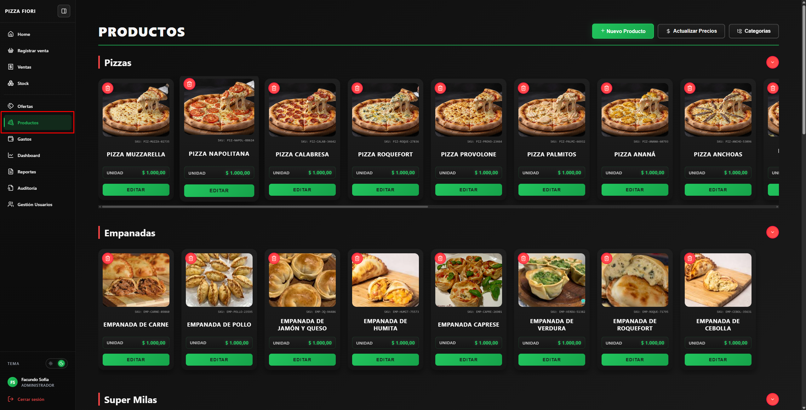

### 8.1 Cómo está organizada la pantalla

Los productos están agrupados por categoría (por ejemplo: Pizzas, Empanadas, Bebidas). Podés expandir o contraer cada grupo haciendo clic en el nombre de la categoría.

Cada producto se muestra como una tarjeta con:
- La imagen del producto (si tiene)
- El nombre
- El SKU (código interno)
- El precio
- Los botones para editar o eliminar

### 8.2 Crear un producto nuevo

1. Hacé clic en el botón **Nuevo Producto** que está en la esquina superior derecha de la pantalla.

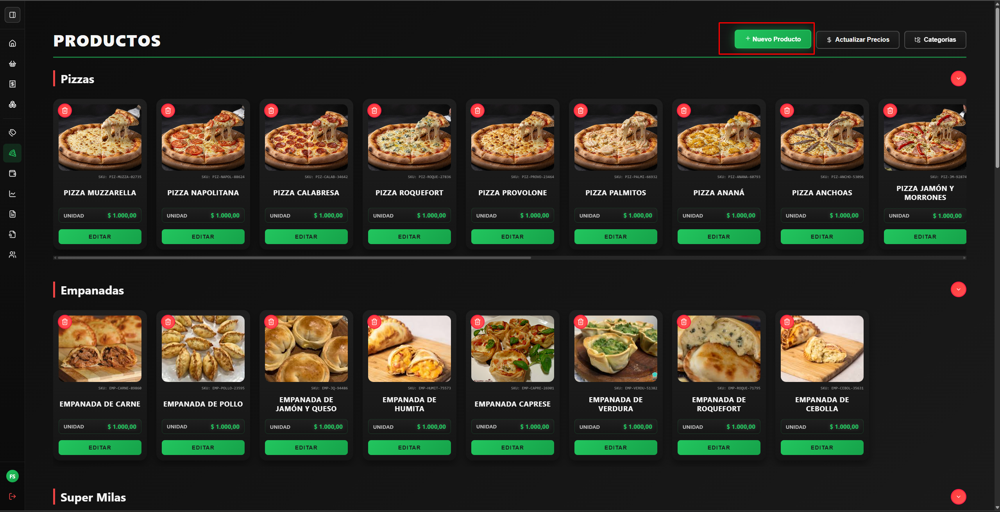

2. Se va a abrir una ventana con un formulario. Completá los siguientes datos:
   - **Nombre**: el nombre del producto tal como aparecerá en el sistema
   - **Categoría**: a qué grupo de productos pertenece (elegís de la lista)
   - **Precio**: el precio de venta
   - **Imagen** (opcional): podés subir una foto del producto
3. Hacé clic en **Guardar**.

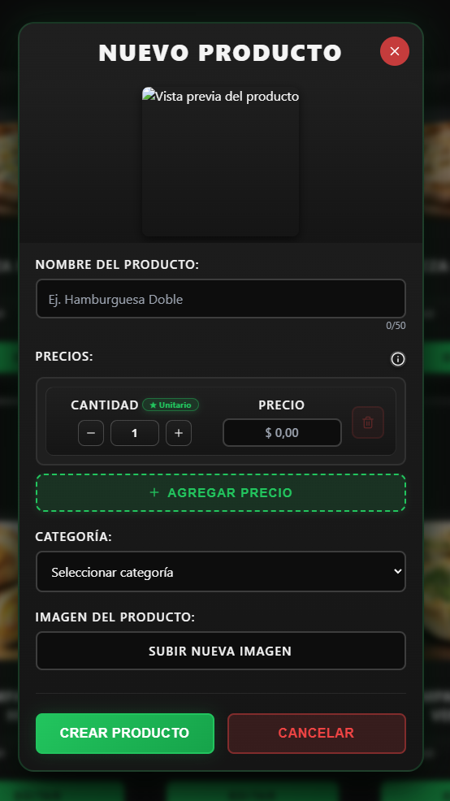

### 8.3 Editar un producto

1. En la tarjeta del producto, hacé clic en el ícono de lápiz ✏️.
2. Se abre la misma ventana de antes pero con los datos ya cargados.
3. Cambiá lo que necesitás.
4. Hacé clic en **Guardar**.

### 8.4 Actualizar precios en masa

Si necesitás cambiar los precios de varios productos al mismo tiempo (por ejemplo, ante una suba de costos):

1. Hacé clic en el botón **Actualizar precios** (o **Precios en masa**) en la parte superior de la pantalla.

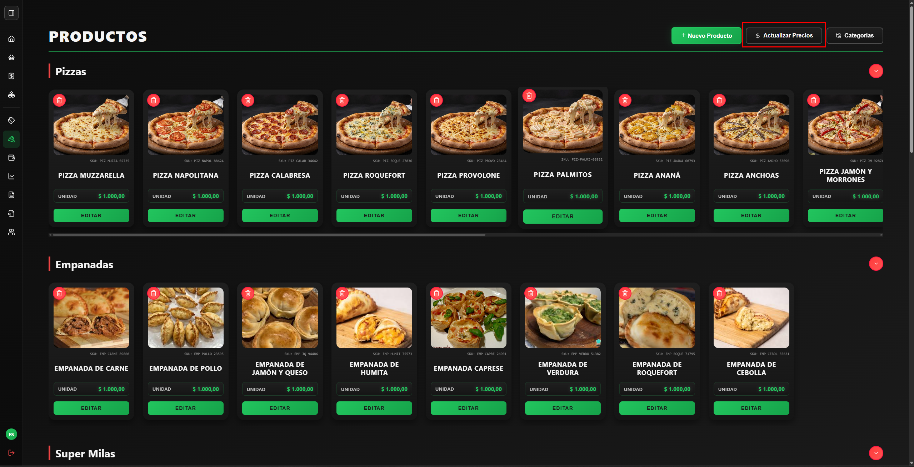

2. Se abre una ventana con todos los productos.
3. Podés elegir si querés aumentar un porcentaje, un monto fijo, o poner el precio exacto para cada uno.
4. Hacé clic en **Guardar** para aplicar los cambios.

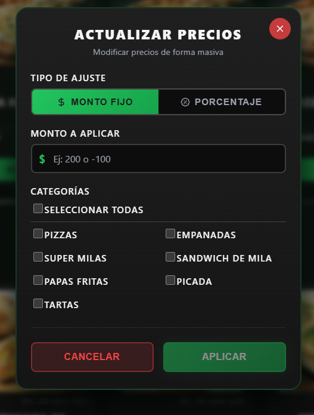

### 8.5 Eliminar un producto

⚠️ **Atención:** Solo eliminá un producto si estás seguro/a de que no lo van a usar más. Si es temporal, mejor desactivarlo (ver sección 8.4).

1. En la tarjeta del producto, hacé clic en el ícono de tacho de basura 🗑️.
2. Confirmá la acción en la ventana que aparece.

### 8.6 Gestionar categorías de productos

1. En la pantalla de Productos, hacé clic en el botón **Categorías** (o **Configurar categorías**).
2. Se abre una ventana donde podés crear categorías nuevas, cambiarles el nombre o desactivarlas.

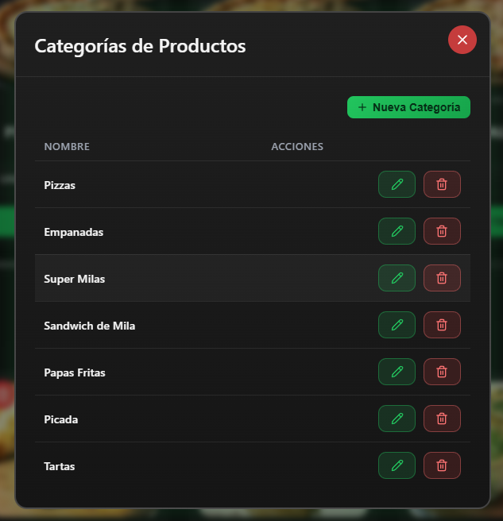

---

## 9. 🔐 Ofertas (Admin)

Las ofertas son combos o precios especiales que el negocio tiene disponibles. Desde aquí las creás, editás y eliminás.

Para llegar, hacé clic en **Ofertas** en el menú lateral.

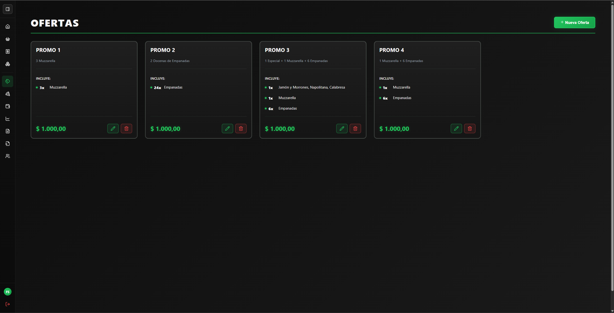

### 9.1 Ver las ofertas

Cada oferta aparece como una tarjeta con el nombre, la descripción y el precio de la oferta.

### 9.2 Crear una oferta nueva

1. Hacé clic en el botón **Nueva Oferta** (está en la esquina superior derecha o bien visible en la pantalla).

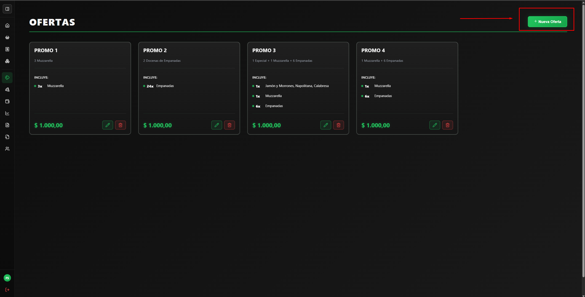

2. Se abre una ventana con el formulario:
   - **Nombre**: cómo se llama la oferta (por ejemplo, "Combo Familiar")
   - **Descripción** (opcional): una descripción breve
   - **Precio**: el precio de la oferta
   - **Ítems de la oferta**: qué productos o categorías incluye la oferta, y en qué cantidad

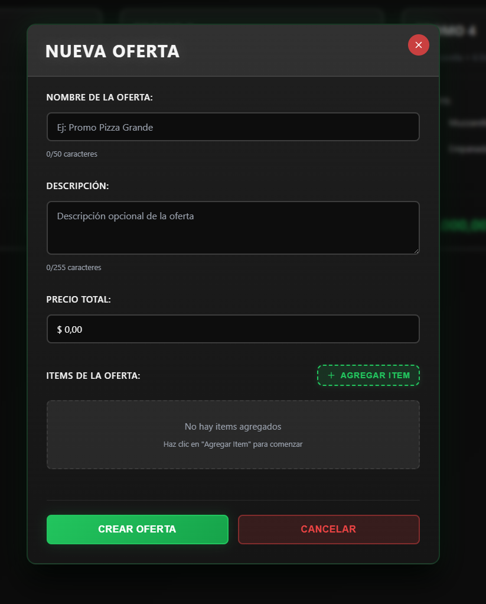

3. Hacé clic en **Guardar**.

### 9.3 Editar una oferta

1. En la tarjeta de la oferta, hacé clic en el ícono de lápiz ✏️.
2. Hacé los cambios que necesitás.
3. Hacé clic en **Guardar**.

### 9.4 Eliminar una oferta

1. En la tarjeta de la oferta, hacé clic en el ícono de tacho 🗑️.
2. Confirmá la acción cuando el sistema te lo pida.

---

## 10. 🔐 Gastos (Admin)

Desde aquí registrás y consultás todos los gastos del negocio, como son los insumos, alquiler, servicios, sueldos, etc.

Para llegar, hacé clic en **Gastos** en el menú lateral.

### 10.1 Cómo leer la lista de gastos

La tabla muestra:
- **Fecha**: cuándo fue el gasto
- **Categoría**: el tipo de gasto (por ejemplo, Insumos → Harina)
- **Descripción** (si se cargó): una nota sobre el gasto
- **Monto**: cuánto salió el gasto
- **Acciones**: editar o eliminar

### 10.2 Registrar un gasto nuevo

1. Hacé clic en el botón **Nuevo Gasto** (o **Agregar gasto**) en la parte superior de la pantalla.

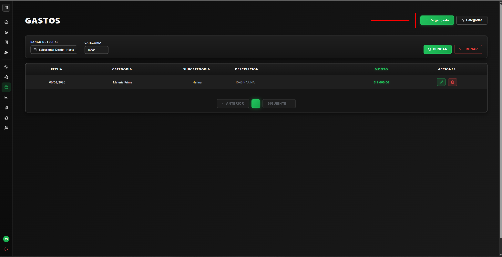

2. Se abre una ventana con el formulario:
   - **Categoría**: elegí el tipo de gasto de la lista. Primero elegís la categoría principal y después la subcategoría si la hay.
   - **Monto**: cuánto costó
   - **Fecha de pago**: cuándo se pagó (por defecto muestra la fecha de hoy)
   - **Descripción** (opcional): podés escribir una nota
3. Hacé clic en **Guardar**.

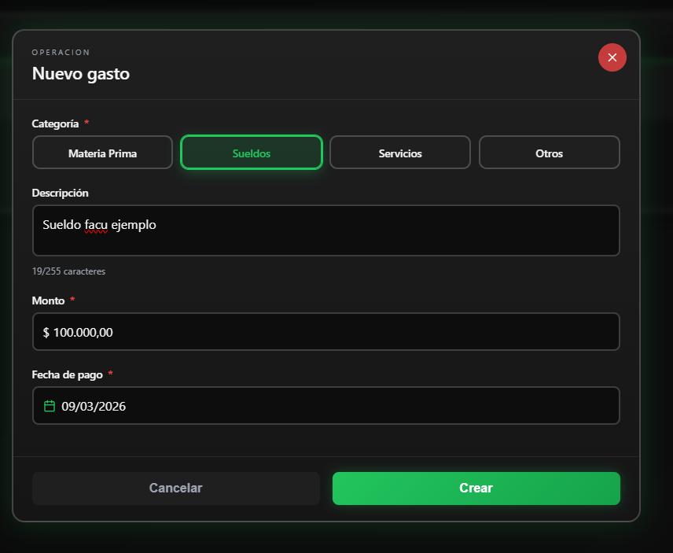

### 10.3 Filtrar gastos

Si querés ver solo los gastos de un período o de una categoría específica:

1. En la parte superior de la pantalla vas a ver los filtros.
2. Elegí el **rango de fechas** (Desde / Hasta).
3. Elegí una **Categoría** y/o **Subcategoría** del desplegable.
4. Hacé clic en **Buscar** (o **Filtrar**).

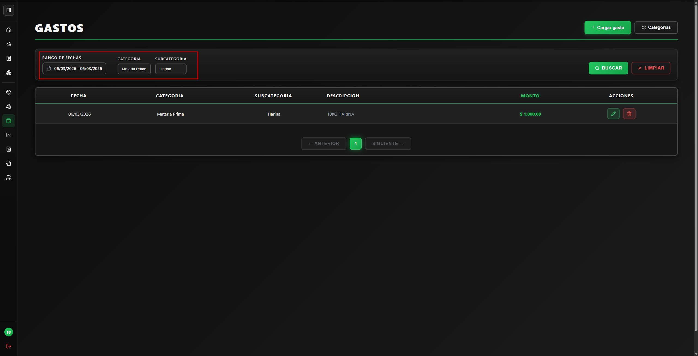

Para volver a ver todos los gastos, hacé clic en **Limpiar**.

### 10.4 Editar un gasto

1. Buscá el gasto en la lista.
2. Hacé clic en el ícono de lápiz ✏️.
3. Modificá lo que necesitás.
4. Hacé clic en **Guardar**.

### 10.5 Eliminar un gasto

1. Buscá el gasto en la lista.
2. Hacé clic en el ícono de tacho 🗑️.
3. Confirmá la eliminación.

### 10.6 Gestionar categorías de gastos

Las categorías tienen una estructura de dos niveles: una categoría principal (por ejemplo, "Insumos") y subcategorías dentro de ella (por ejemplo, "Harina", "Queso", "Tomate").

1. En la pantalla de Gastos, hacé clic en el botón **Categorías** (o **Gestionar categorías**).
2. Se abre una pantalla donde podés crear, editar y desactivar categorías y subcategorías.

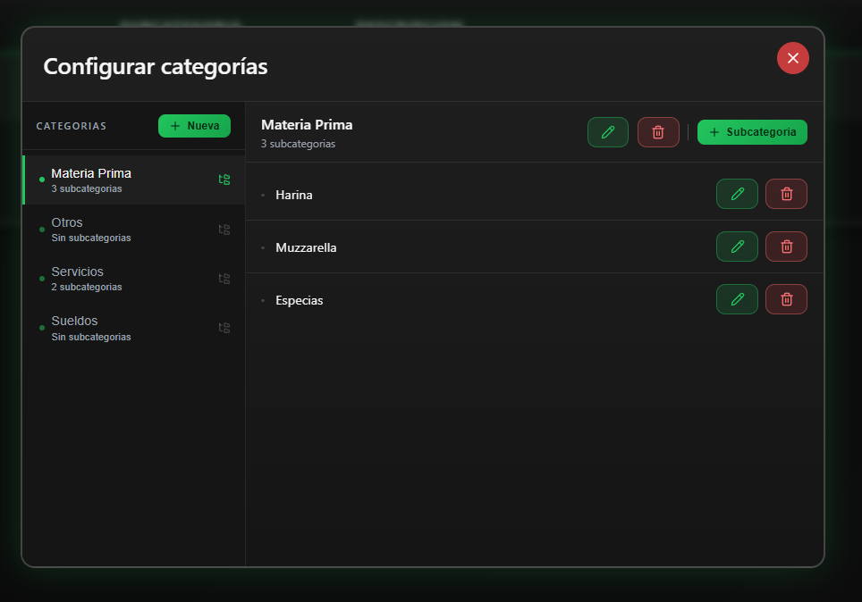

---

## 11. 🔐 Dashboard — Estadísticas (Admin)

El Dashboard es la pantalla de estadísticas y gráficos. Te muestra cómo está yendo el negocio en números y de forma visual.

Para llegar, hacé clic en **Dashboard** en el menú lateral.

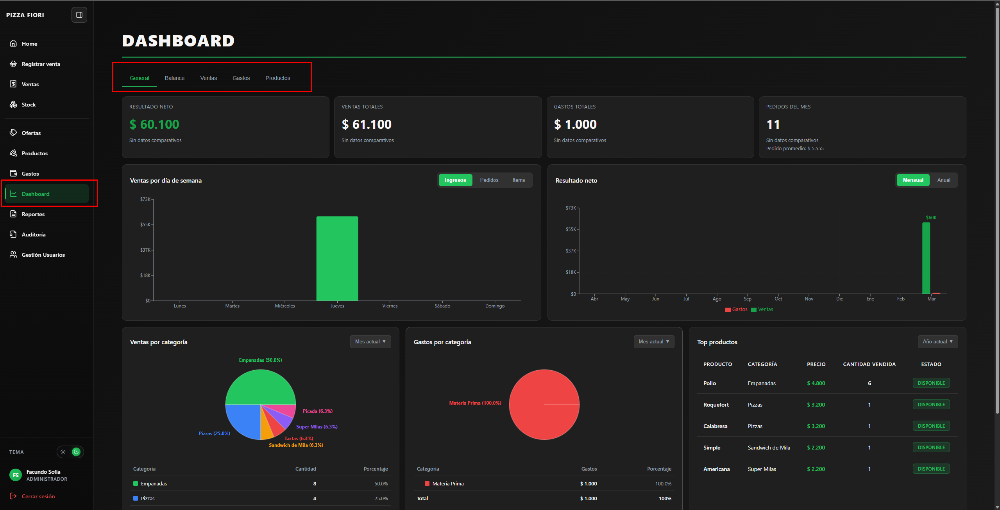

La pantalla tiene **5 pestañas** (como las fichas de una carpeta): podés hacer clic en cada una para cambiar de vista.

### 11.1 Pestaña General

Muestra un resumen del negocio:

- **Tarjetas de indicadores (KPIs):** números clave del período elegido:
  - Total de ingresos por ventas
  - Total de gastos
  - Ganancia neta
  - Margen de ganancia (%)
  - Cantidad de órdenes

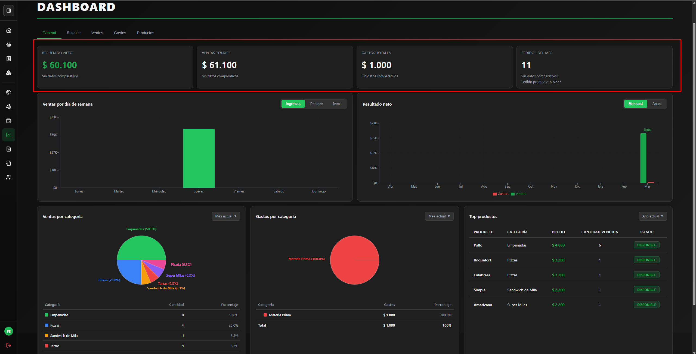

- **Gráfico de ventas por categoría**: qué categoría de productos generó más ingresos
- **Tabla de productos más vendidos**: el ranking de los ítems que más salieron

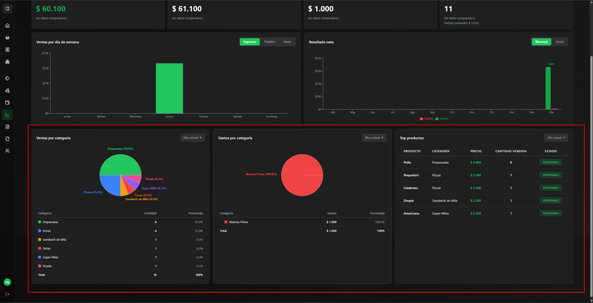

### 11.2 Pestaña Balance

Muestra la diferencia entre lo que entró (ventas) y lo que salió (gastos):

- **Ganancia neta**: cuánto quedó después de pagar los gastos
- **Margen de ganancia**: qué porcentaje de las ventas fue ganancia
- **Gráfico de balance mensual**: la evolución mes a mes de la ganancia

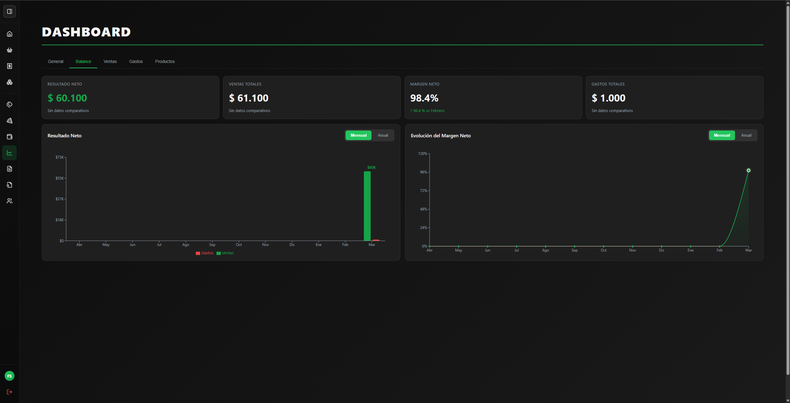

### 11.3 Pestaña Ventas

Muestra la evolución de las ventas a lo largo del tiempo:

- Un gráfico que podés ver por mes o por año
- Podés elegir qué métrica mostrar: **Ingresos** (en pesos), **Cantidad de ítems vendidos** o **Número de órdenes**

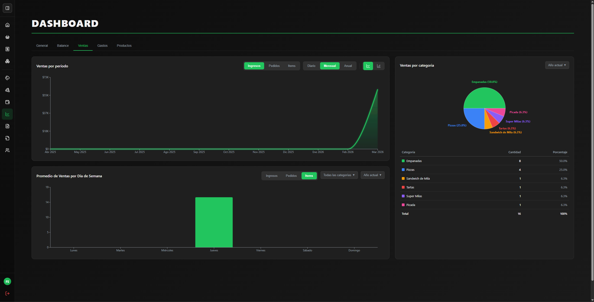

### 11.4 Pestaña Gastos

Muestra la evolución de los gastos:

- Gráfico de gastos por mes
- Desglose de gastos por categoría (cuánto gastaste en insumos, en alquiler, etc.)

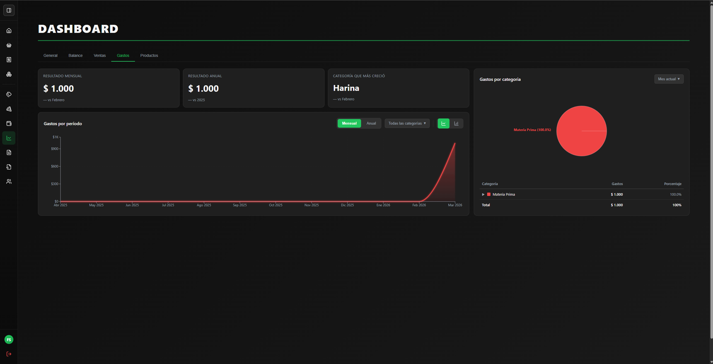

### 11.5 Pestaña Productos

Muestra qué productos se venden más y cuáles menos:

- Un ranking de los productos más o menos vendidos
- Podés filtrar por categoría

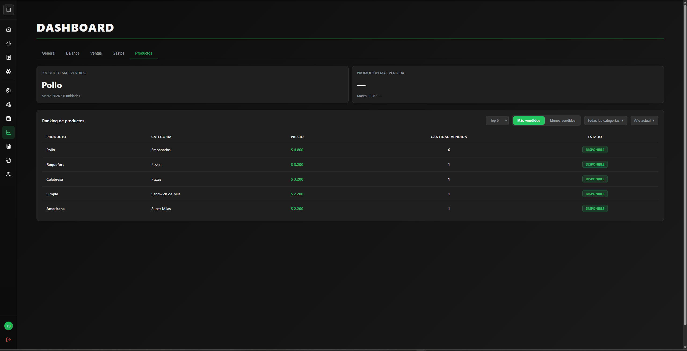

### 11.6 Cambiar el período de tiempo

En varias partes del Dashboard vas a ver un selector de período. Podés elegir entre:

| Opción | Qué muestra |
|--------|-------------|
| **Mes actual** | Solo los datos del mes en curso |
| **Año actual** | Los datos desde enero hasta hoy |
| **Histórico** | Todos los datos desde siempre |

### 11.7 Cambiar el tipo de gráfico

En los gráficos que lo permiten, hay dos botones para elegir cómo ver los datos:
- **Barras** 📊: más fácil para comparar entre períodos
- **Área** 📈: más fácil para ver la tendencia

Hacé clic en el ícono que prefieras para cambiar la vista.

---

## 12. 🔐 Reportes (Admin)

Los reportes te permiten generar documentos en PDF con el resumen del negocio para un período de tiempo determinado.

Para llegar, hacé clic en **Reportes** en el menú lateral.

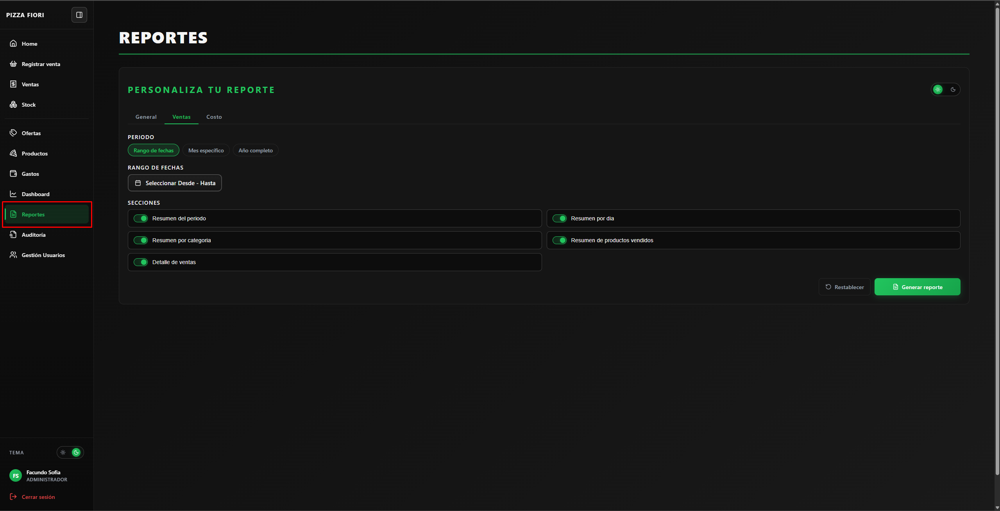

### 12.1 Configurar el reporte

**Paso 1 — Elegir el tipo de reporte**

En la parte superior vas a ver tres opciones (generalmente aparecen como botones o pestañas):

| Tipo | Qué incluye |
|------|-------------|
| **Ventas** | Resumen y detalle de todas las ventas del período |
| **Costos** | Resumen y detalle de los gastos del período |
| **General** | Combina ventas, gastos y balance en un solo informe |

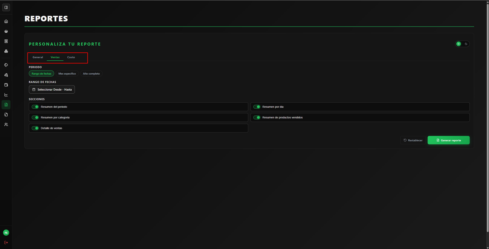

**Paso 2 — Elegir el período**

Vas a ver dos opciones:
- **Rango de fechas**: elegís una fecha de inicio y una fecha de fin
- **Por mes/año**: elegís un mes y un año específico

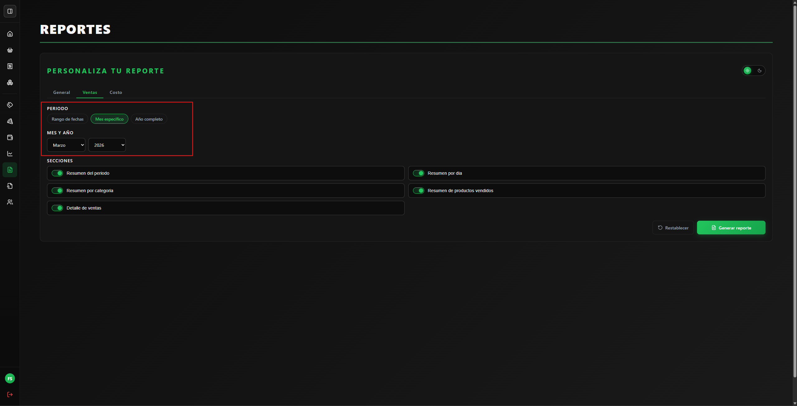

**Paso 3 — Elegir las secciones a incluir**

Hay una lista de casillas de verificación (checkbox ☑️). Cada casilla representa una sección del reporte. Marcá solo las que querés que aparezcan en el PDF.

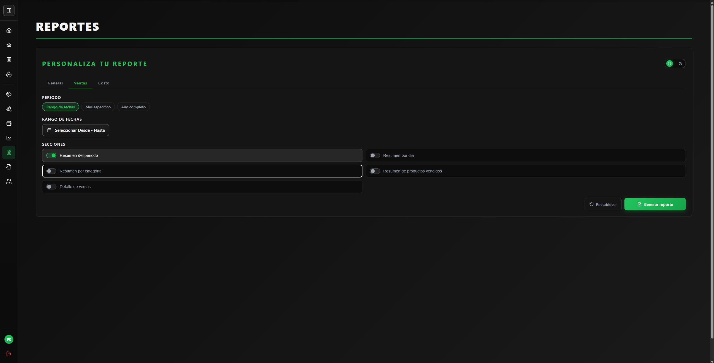

**Paso 4 — Elegir el modo de color**

Podés generar el PDF en modo **claro** (fondo blanco) o **oscuro** (fondo negro). Para imprimir conviene el modo claro.

### 12.2 Generar y descargar el PDF

1. Una vez que configuraste todo, hacé clic en el botón **Generar reporte** (o **Descargar PDF**).
2. El sistema va a preparar el archivo. Puede tardar unos segundos.
3. Una vez listo, el archivo se descarga automáticamente a tu computadora.
4. Podés abrirlo haciendo doble clic en el archivo descargado.

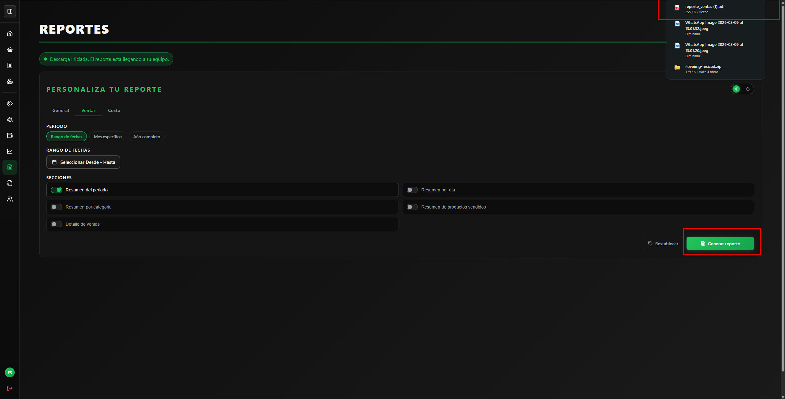

💡 **Consejo:** El archivo descargado aparece generalmente en la carpeta **Descargas** de tu computadora.

---

## 13. 🔐 Auditoría (Admin)

El registro de auditoría guarda automáticamente un historial de todos los cambios que se hicieron en el sistema: qué se creó, qué se modificó y qué se eliminó, con la fecha y el usuario que lo hizo.

No hay que hacer nada para que esto funcione: el sistema lo registra solo. Esta pantalla es solo para *consultar* ese historial.

Para llegar, hacé clic en **Auditoría** en el menú lateral.

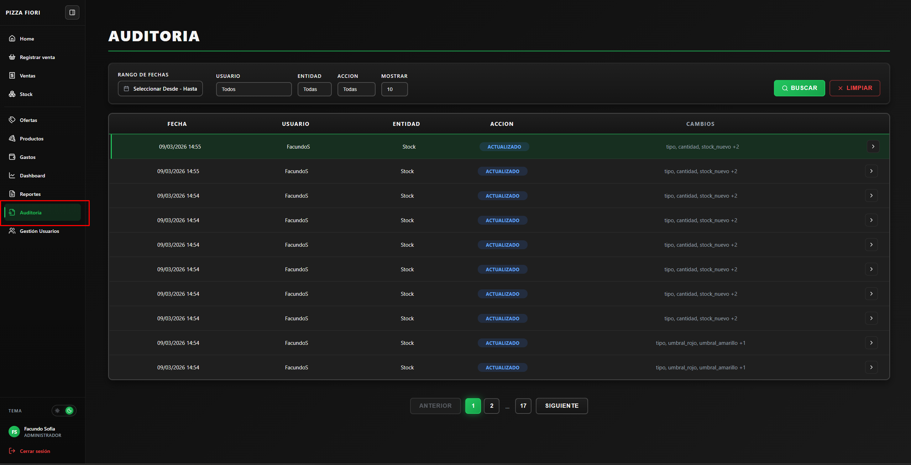

### 13.1 Cómo leer la tabla de auditoría

Cada fila es un cambio que ocurrió en el sistema:
- **Fecha/Hora**: cuándo ocurrió el cambio
- **Usuario**: quién lo hizo
- **Tipo**: qué se cambió (Producto, Venta, Gasto, Usuario, etc.)
- **Acción**: qué tipo de cambio fue (Creado / Actualizado / Eliminado)

### 13.2 Filtrar el historial

Podés buscar cambios específicos usando los filtros:

1. **Por fecha**: elegí el rango de fechas que te interesa
2. **Por tabla/tipo**: elegí qué tipo de elemento se modificó (Producto, Venta, Gasto, etc.)
3. **Por acción**: elegí si fue un **Creado**, **Actualizado** o **Eliminado**
4. **Por usuario**: elegí de la lista el usuario cuyas acciones querés ver
5. Hacé clic en **Buscar** o **Aplicar filtros**.

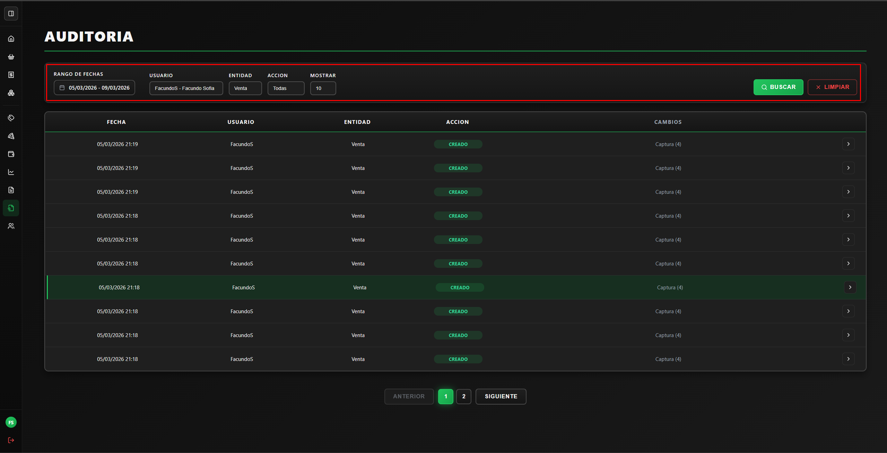

### 13.3 Ver el detalle de un cambio

Si querés ver exactamente qué cambió:

1. Hacé clic en la fila del registro que te interesa (o en un ícono de expansión ▶️).
2. Se va a expandir la fila y vas a ver dos columnas:
   - **Valor anterior**: cómo estaba antes del cambio
   - **Valor nuevo**: cómo quedó después

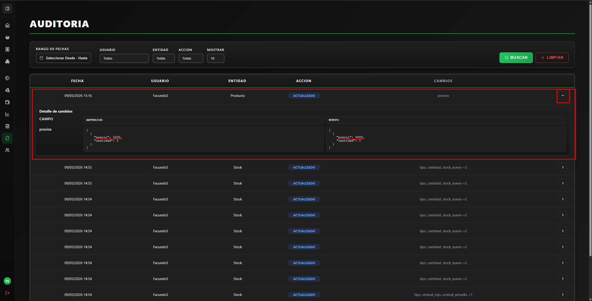

---

## 14. 🔐 Gestión de Usuarios (Admin)

Desde aquí creás las cuentas para las personas que van a usar el sistema, y también podés eliminar cuentas o desbloquear usuarios que quedaron bloqueados.

Para llegar, hacé clic en **Gestión Usuarios** en el menú lateral.

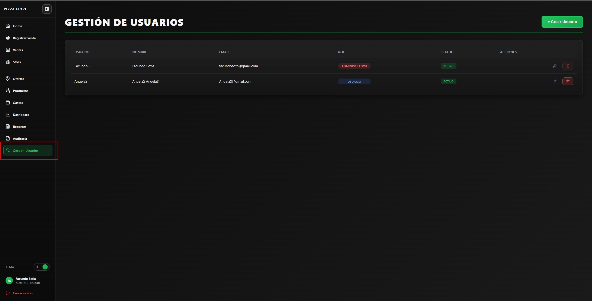

### 14.1 Ver la lista de usuarios

La tabla muestra todos los usuarios del sistema con:
- **Usuario**: el nombre de usuario con el que entran
- **Email**: el correo electrónico
- **Rol**: si es USUARIO o ADMINISTRADOR
- **Estado**: si la cuenta está activa o bloqueada
- **Acciones**: botones para desbloquear o eliminar

### 14.2 Crear un usuario nuevo

1. Hacé clic en el botón **Nuevo Usuario** (o **Crear usuario**) en la parte superior.

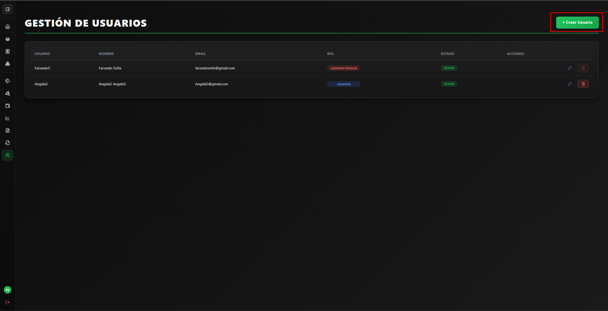

2. Se abre un formulario. Completá todos los campos:
   - **Nombre**: el nombre real de la persona
   - **Apellido**: el apellido real
   - **Usuario**: el nombre con el que va a entrar al sistema (sin espacios, solo letras y números)
   - **Email**: el correo electrónico de la persona
   - **Contraseña**: la contraseña inicial (la persona la puede cambiar después desde su perfil)
   - **Rol**: elegí **USUARIO** si va a usar el sistema para registrar ventas y ver stock, o **ADMINISTRADOR** si va a tener acceso total
3. Hacé clic en **Guardar** o **Crear usuario**.

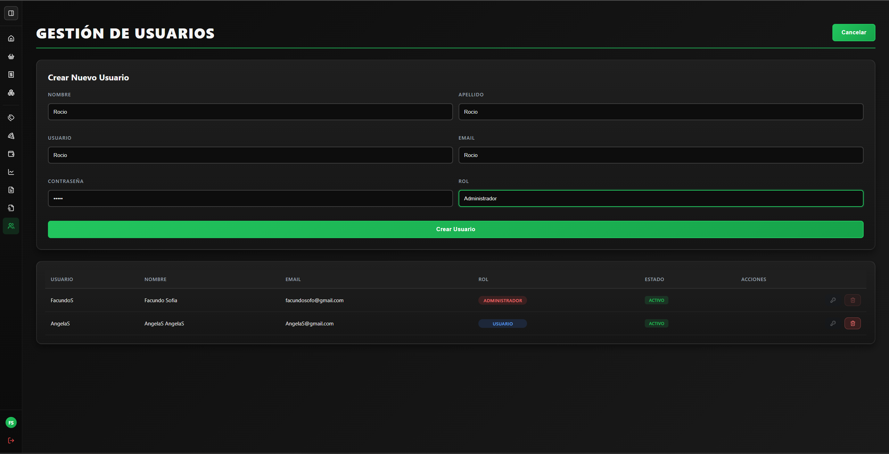

⚠️ **Atención:** Elegí el rol con cuidado. Los Administradores tienen acceso completo al sistema, incluyendo datos financieros y la capacidad de eliminar registros.

### 14.3 Desbloquear una cuenta

Si un usuario ingresó mal la contraseña muchas veces seguidas, el sistema le bloquea la cuenta por seguridad. Vas a ver su estado como "Bloqueado".

Para desbloquearlo:

1. Buscalo en la lista.
2. Hacé clic en el botón de **Desbloquear** (ícono de candado abierto 🔓).
3. Confirmá la acción.

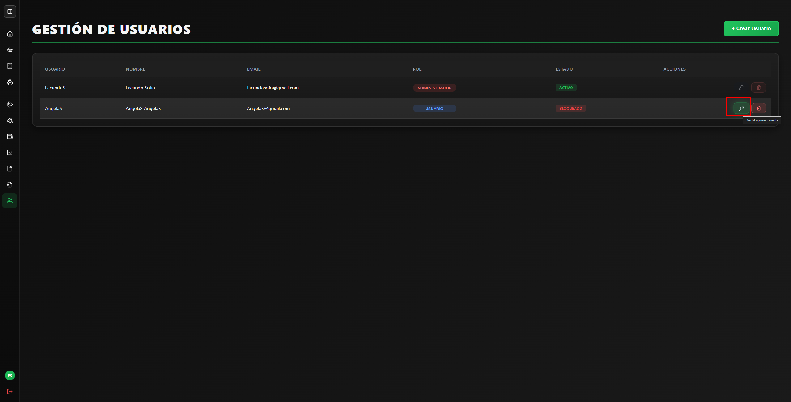

El usuario va a poder entrar normalmente de nuevo.

### 14.4 Eliminar un usuario

⚠️ **Atención:** No podés eliminar tu propio usuario (el que estás usando en ese momento). Tampoco podés eliminar el último administrador del sistema.

1. Buscá el usuario en la lista.
2. Hacé clic en el ícono de tacho 🗑️.
3. Confirmá la eliminación en la ventana que aparece.

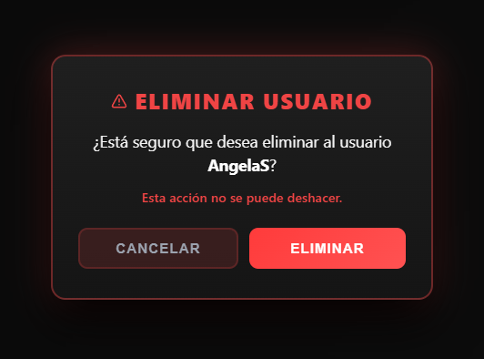

---

## 15. Preguntas frecuentes

**¿Qué hago si la pantalla no carga o aparece en blanco?**
> Intentá recargar la página presionando **F5** en el teclado, o el botón de "actualizar" del navegador (ícono de flecha circular). Si el problema persiste, avisale al administrador o a soporte.

**¿Qué pasa si cierro el navegador mientras tengo una venta a medias?**
> La venta no se guarda si no la confirmás. La próxima vez que entres, vas a tener que volver a cargar los productos. Siempre confirmá la venta antes de cerrar.

**¿El sistema funciona en el celular?**
> El sistema está pensado para usarse en una computadora. Puede funcionar en algunos celulares, pero la experiencia es mejor en pantalla grande.

**¿Cómo sé si un producto se quedó sin stock?**
> En la pantalla de **Stock**, el indicador del producto va a aparecer en **rojo** cuando el stock esté en cero o por debajo del mínimo configurado. También, si intentás registrar una venta con un producto sin stock, el sistema podría advertirte.

**¿Puedo recuperar una venta que eliminé?**
> No. Una vez que eliminás una venta, no se puede recuperar. Por eso el sistema te pide confirmación antes de eliminar. Si tenés dudas, mejor no eliminar.

**¿Qué es el SKU de un producto?**
> El SKU es el código interno del producto. Lo genera automáticamente el sistema cuando creas un producto nuevo. No es necesario que lo recuerdes, es solo para identificar cada producto de manera única.

**Me aparece "Acceso Denegado" en una pantalla**
> Eso significa que esa sección está reservada para Administradores. Si creés que deberías tener acceso, avisale al administrador para que revise tu rol.

---

*Manual de Usuario — Pizza Fiori · Versión 1.0 · Marzo 2026*
*Para soporte técnico o consultas, comunicarse con el administrador del sistema.*
